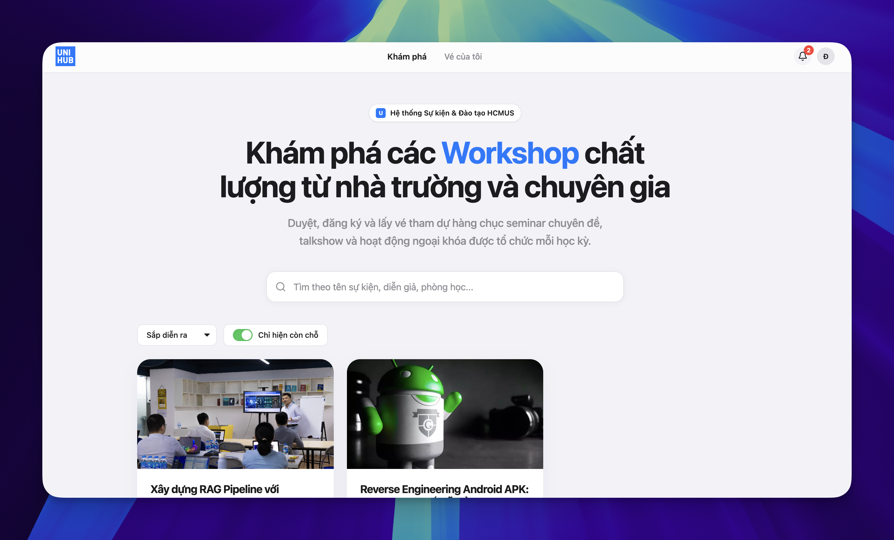

# UNIHUB WORKSHOP




UniHub Workshop là hệ thống đăng ký workshop nội bộ cho trường đại học. Dự án thay Google Form bằng một ứng dụng có đăng ký chỗ ngồi, thanh toán mock, vé QR, check-in offline-first, dashboard thống kê, import sinh viên từ CSV và AI Summary từ PDF.

**Nhóm 16, lớp 23TKPM1**

| MSSV | Họ và tên | Email |
|------|-----------|-------|
| 23127417 | Đào Hoàng Đức Mạnh | <dhdmanh23@clc.fitus.edu.vn> |
| 22127403 | Nguyễn Trần Minh Thư | <ntmthu22@clc.fitus.edu.vn> |
| 23127362 | Phạm Anh Hào | <pahao23@clc.fitus.edu.vn> |

## Tính năng chính

- Sinh viên xem workshop, đăng ký workshop miễn phí hoặc có phí, nhận vé QR và xem vé đã đăng ký.
- Ban tổ chức tạo, sửa, publish, hủy workshop, upload ảnh, upload PDF để tạo AI Summary và xem dashboard thống kê.
- Nhân sự check-in quét QR bằng PWA, lưu tạm khi mất mạng và đồng bộ lại khi có mạng.
- Hệ thống import danh sách sinh viên từ file CSV nightly trong `legacy-data/`.
- Payment và email đang là mock để phục vụ demo localhost.

## Tech stack

- Frontend: React 19, Vite 6, TypeScript, Tailwind CSS, React Router, TanStack Query, Supabase JS, PWA.
- Backend: Express 4, TypeScript, Supabase JS, Zod, pdf-parse, PapaParse, opossum, node-cron.
- Database: Supabase Postgres, Auth, Realtime, Storage.
- AI Summary: backend gọi OpenRouter từ Express. Dự án không dùng OpenAI API cho luồng summary hiện tại.
- Test: Vitest.

## Cấu trúc thư mục

```text
frontend/             React PWA
backend/              Express API
supabase/db_schema.sql
legacy-data/          CSV sinh viên mẫu
blueprint/            tài liệu thiết kế và spec chi tiết
docs/                 ghi chú tech stack
img/                  sơ đồ minh họa
full-guide.md         quy ước kỹ thuật chính của repo
```

Chi tiết kiến trúc, RBAC, API, database schema và ADR nằm trong `blueprint/design.md` và `full-guide.md`. README này chỉ giữ phần hướng dẫn chạy và test nhanh.

## Yêu cầu

- Node.js 20 trở lên
- npm 10 trở lên
- File `.env` ở thư mục gốc project
- Nếu tự tạo database mới: một Supabase project trống để chạy `supabase/db_schema.sql`

## Cài đặt

Clone repo và cài dependencies:

```bash
git clone <repo-url>
cd 23tkpm1-group16-unihub-workshop

cd frontend && npm install && cd ..
cd backend && npm install && cd ..
```

### Cấu hình nhanh bằng `.env` có sẵn

Tải file `.env` demo tại: [https://www.mediafire.com/file/uwbs84udzt3eu4g/.env/file](https://www.mediafire.com/file/uwbs84udzt3eu4g/.env/file)

Đặt file `.env` tại thư mục gốc, ngang hàng với `README.md`.

```text
23tkpm1-group16-unihub-workshop/
  .env
  frontend/
  backend/
  supabase/
```

File `.env` này trỏ tới database demo đã có dữ liệu mẫu, gồm workshop, đăng ký, vé, tài khoản admin, staff và tài khoản sinh viên `23127417 / 123456`.

### Tự setup Supabase riêng

Nếu muốn dùng database riêng, tạo Supabase project mới rồi vào SQL Editor chạy toàn bộ nội dung:

```text
supabase/db_schema.sql
```

File này là bản clone schema của dự án, gồm extensions, enums, tables, constraints, triggers, indexes, RLS, grants, realtime publication, RPC functions, storage bucket `workshop-assets`, storage policies và 2 tài khoản test cơ bản.

Sau đó tạo `.env` riêng với các key tương ứng của Supabase project mới và OpenRouter. Có thể dựa theo file `.env` demo để giữ đúng tên biến.

`db_schema.sql` chỉ seed 2 tài khoản auth để thầy test quyền quản trị và check-in:

| Màn hình | Tài khoản | Mật khẩu | Vai trò |
|----------|-----------|----------|--------|
| `/staff-login` | `admin@unihub` | `123` | Ban tổ chức |
| `/staff-login` | `staff@unihub` | `123` | Nhân sự check-in |

Tài khoản sinh viên mẫu `23127417 / 123456` chỉ có sẵn trong database demo đi kèm file `.env` tải ở trên. Nếu dùng Supabase riêng, cần import CSV hoặc tạo dữ liệu sinh viên tương ứng trước khi test luồng sinh viên.

## Chạy ứng dụng

Mở 2 terminal:

```bash
# Terminal 1: backend
cd backend
npm run dev
```

```bash
# Terminal 2: frontend
cd frontend
npm run dev
```

Mặc định:

- Backend: `http://localhost:3000`
- Frontend: `https://localhost:5173`

Vite đang bật HTTPS local bằng plugin `@vitejs/plugin-basic-ssl`. Nếu trình duyệt báo certificate warning, chọn cho phép tiếp tục. Nếu gõ `localhost:5173` hoặc `localhost:3000` không vào được, thêm đầy đủ `https://` hoặc `http://` ở trước URL.

## Tài khoản test

Khi dùng file `.env` demo đã cung cấp, có thể đăng nhập bằng các tài khoản sau:

| Màn hình | Tài khoản | Mật khẩu | Vai trò |
|----------|-----------|----------|--------|
| `/staff-login` | `admin@unihub` | `123` | Ban tổ chức |
| `/staff-login` | `staff@unihub` | `123` | Nhân sự check-in |
| `/login` | `23127417` | `123456` | Sinh viên, chỉ có sẵn trong DB demo |

Ghi chú:

- Admin vào trang quản trị tại `/admin`.
- Staff vào trang check-in tại `/staff`.
- Sinh viên có thể đăng nhập bằng MSSV tại `/login`.
- CSV mẫu có trong `legacy-data/students_nightly_2026-05-17.csv`.

## Luồng test nhanh

1. Vào frontend tại `https://localhost:5173`.
2. Đăng nhập sinh viên bằng `23127417` và mật khẩu `123456`.
3. Xem danh sách workshop, mở chi tiết workshop và đăng ký.
4. Đăng nhập `admin@unihub` tại `/staff-login` để tạo, sửa, publish workshop, upload PDF AI Summary và xem dashboard.
5. Đăng nhập `staff@unihub` tại `/staff-login` để quét QR và test check-in.
6. Tắt mạng rồi quét QR trên trang staff để test lưu offline, sau đó bật mạng và bấm đồng bộ.

## Import sinh viên CSV

File CSV mẫu nằm trong `legacy-data/` và dùng format:

```csv
mssv,full_name
23127417,Đào Hoàng Đức Mạnh
```

Backend có cron import lúc 02:00 hằng ngày theo múi giờ `Asia/Ho_Chi_Minh`. Ban tổ chức cũng có thể trigger import từ trang admin hoặc gọi endpoint:

```text
POST /api/v1/admin/csv-import
```

Nếu body rỗng, backend sẽ lấy file `students_nightly_YYYY-MM-DD.csv` mới nhất trong `legacy-data/` hoặc `CSV_IMPORT_DIR`.

## AI Summary

AI Summary nhận PDF từ trang admin, backend đọc nội dung bằng `pdf-parse`, gọi OpenRouter để tạo summary Markdown và lưu vào cột `summary_md`.

Nếu dùng `.env` riêng mà thiếu OpenRouter key, riêng tính năng AI Summary sẽ báo lỗi `AI_UNAVAILABLE`. Các tính năng khác vẫn chạy bình thường.

## Chạy test

```bash
cd backend
npm test
```

```bash
cd frontend
npm test
```

## Tài liệu tham khảo

| File | Nội dung |
|------|----------|
| `blueprint/proposal.md` | Bối cảnh, phạm vi và mục tiêu |
| `blueprint/design.md` | Kiến trúc, RBAC, API, database schema, ADR |
| `blueprint/specs/` | Spec chi tiết từng module |
| `full-guide.md` | Quy ước kỹ thuật chính của repo |
| `supabase/db_schema.sql` | Schema Supabase hiện tại |
| `legacy-data/README.md` | Hướng dẫn CSV nightly |
