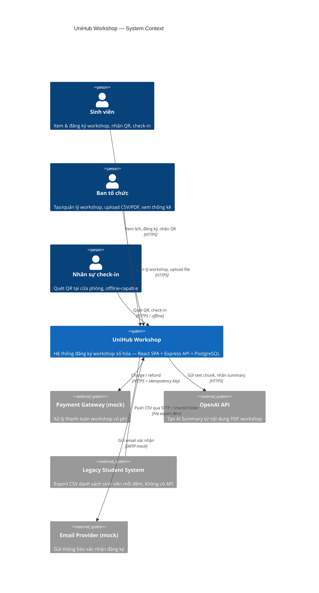
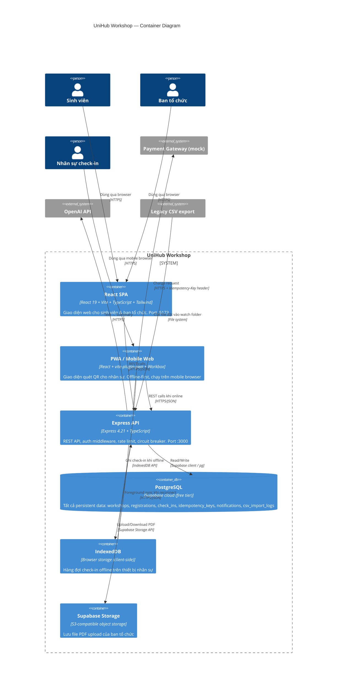
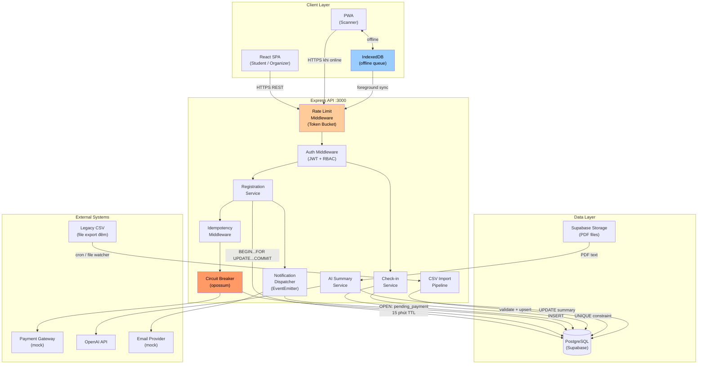
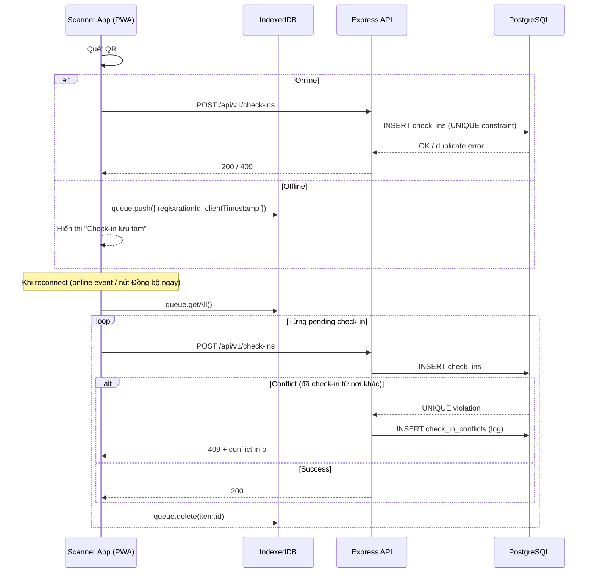

# UniHub Workshop — Technical Design

---

## Kiến trúc tổng thể

**Phong cách được chọn: Modular Monolith** kết hợp 3 sub-style áp dụng cho từng phần khác nhau.

| Phần hệ thống | Phong cách | Lý do |
|---|---|---|
| Backend core (routes → services → repos) | **Layered** (4 lớp) | Tách concern rõ ràng, dễ test từng lớp |
| Notification dispatch, AI Summary trigger | **Event-based / Implicit Invocation** | Decoupled — thêm kênh mới không sửa logic đăng ký |
| CSV import pipeline | **Batch Sequential** | Dữ liệu chạy qua pipeline read → validate → transform → upsert, phù hợp với batch job đêm |
| Giao tiếp client ↔ server | **Client-Server** (REST/HTTPS) | Stateless, cacheable, phù hợp với React SPA + mobile web |

**Tại sao không Microservices:** đội 3 người, timeline 2 ngày MVP — overhead service discovery và distributed tracing vượt capacity. Áp dụng YAGNI (mục 10 ADR). Backend Express duy nhất dễ debug, dễ deploy, không mất 30–40% time vào infra.

**4 lớp của Layered backend:**

```
Presentation  →  Business Logic  →  Adapter  →  Data Access
(Express routes)  (services/)      (interfaces/)  (repositories/ + Supabase)
```

---

## C4 Diagram

### Level 1 — System Context



### Level 2 — Container



---

## High-Level Architecture Diagram

Sơ đồ luồng dữ liệu tại các điểm tích hợp quan trọng:



**Luồng offline check-in:**



---

## Thiết kế cơ sở dữ liệu

### Lựa chọn database

**PostgreSQL (Supabase cloud)** — một database duy nhất, không polyglot.

Lý do: dữ liệu có quan hệ chặt chẽ (workshop ↔ registrations ↔ students), cần ACID cho seat reservation, cần JOIN cho dashboard thống kê, Supabase cung cấp thêm Auth, RLS, Realtime, Storage miễn phí trên free tier.

Không dùng Redis (không cần distributed cache với single-instance MVP), không dùng MongoDB (dữ liệu structured, JOIN nhiều), không sharding (chưa vượt ngưỡng).

### Schema

```sql
-- Sinh viên (import từ CSV, xác thực khi đăng ký)
CREATE TABLE students (
    id              UUID PRIMARY KEY DEFAULT gen_random_uuid(),
    student_code    VARCHAR(20) UNIQUE NOT NULL,
    email           VARCHAR(255) UNIQUE NOT NULL,
    full_name       VARCHAR(255) NOT NULL,
    faculty         VARCHAR(100),
    created_at      TIMESTAMPTZ DEFAULT now(),
    updated_at      TIMESTAMPTZ DEFAULT now()
);

-- Workshop
CREATE TABLE workshops (
    id              UUID PRIMARY KEY DEFAULT gen_random_uuid(),
    title           VARCHAR(500) NOT NULL,
    description     TEXT,
    speaker         VARCHAR(255),
    room            VARCHAR(100),
    room_map_url    TEXT,
    start_time      TIMESTAMPTZ NOT NULL,
    end_time        TIMESTAMPTZ NOT NULL,
    capacity        INTEGER NOT NULL CHECK (capacity > 0),
    seats_remaining INTEGER NOT NULL CHECK (seats_remaining >= 0),
    fee             NUMERIC(12,2) NOT NULL DEFAULT 0,
    summary         TEXT,          -- AI-generated
    pdf_url         TEXT,
    status          VARCHAR(20) NOT NULL DEFAULT 'active'
                        CHECK (status IN ('active','cancelled','completed')),
    created_by      UUID REFERENCES auth.users(id),
    created_at      TIMESTAMPTZ DEFAULT now()
);

-- Đăng ký
CREATE TABLE registrations (
    id              UUID PRIMARY KEY DEFAULT gen_random_uuid(),
    student_id      UUID NOT NULL REFERENCES students(id),
    workshop_id     UUID NOT NULL REFERENCES workshops(id),
    status          VARCHAR(30) NOT NULL DEFAULT 'pending_payment'
                        CHECK (status IN ('pending_payment','confirmed','cancelled','refunded')),
    idempotency_key VARCHAR(255) UNIQUE,
    qr_token        VARCHAR(255) UNIQUE,
    paid_at         TIMESTAMPTZ,
    created_at      TIMESTAMPTZ DEFAULT now(),
    UNIQUE (student_id, workshop_id)
);

-- Check-in
CREATE TABLE check_ins (
    id                  UUID PRIMARY KEY DEFAULT gen_random_uuid(),
    registration_id     UUID NOT NULL REFERENCES registrations(id),
    scanned_at          TIMESTAMPTZ NOT NULL DEFAULT now(),
    scanner_user_id     UUID REFERENCES auth.users(id),
    source              VARCHAR(10) NOT NULL CHECK (source IN ('online','offline')),
    client_timestamp    TIMESTAMPTZ,
    UNIQUE (registration_id)   -- chống check-in 2 lần
);

-- Conflict log (khi sync offline phát hiện trùng)
CREATE TABLE check_in_conflicts (
    id                  UUID PRIMARY KEY DEFAULT gen_random_uuid(),
    registration_id     UUID NOT NULL REFERENCES registrations(id),
    conflict_source     VARCHAR(10),
    client_timestamp    TIMESTAMPTZ,
    server_record_at    TIMESTAMPTZ,
    logged_at           TIMESTAMPTZ DEFAULT now()
);

-- Idempotency keys (chống double-charge)
CREATE TABLE idempotency_keys (
    key         VARCHAR(255) PRIMARY KEY,
    endpoint    VARCHAR(255) NOT NULL,
    response    JSONB NOT NULL,
    created_at  TIMESTAMPTZ DEFAULT now()
);

-- Thông báo in-app
CREATE TABLE notifications (
    id          UUID PRIMARY KEY DEFAULT gen_random_uuid(),
    user_id     UUID NOT NULL REFERENCES auth.users(id),
    channel     VARCHAR(20) NOT NULL CHECK (channel IN ('in_app','email','telegram')),
    title       VARCHAR(500) NOT NULL,
    body        TEXT NOT NULL,
    status      VARCHAR(20) NOT NULL DEFAULT 'pending'
                    CHECK (status IN ('pending','sent','failed')),
    created_at  TIMESTAMPTZ DEFAULT now()
);

-- Log import CSV
CREATE TABLE csv_import_logs (
    id          UUID PRIMARY KEY DEFAULT gen_random_uuid(),
    file_name   VARCHAR(500) NOT NULL,
    total_rows  INTEGER NOT NULL DEFAULT 0,
    imported    INTEGER NOT NULL DEFAULT 0,
    skipped     INTEGER NOT NULL DEFAULT 0,
    errors      JSONB,
    started_at  TIMESTAMPTZ DEFAULT now(),
    finished_at TIMESTAMPTZ
);
```

### Indexing strategy

```sql
CREATE INDEX idx_workshops_start_time ON workshops(start_time);
CREATE INDEX idx_registrations_student ON registrations(student_id, status);
CREATE INDEX idx_registrations_workshop ON registrations(workshop_id, status);
-- check_ins: UNIQUE(registration_id) đã tạo index ngầm
-- idempotency_keys: PRIMARY KEY đã tạo index ngầm
```

Không index `notifications.body` (text dài, không query), không index `students.full_name` ở MVP (chưa có search feature).

---

## Thiết kế kiểm soát truy cập

### Mô hình: RBAC 2 lớp (Defense in Depth)

| Lớp | Cơ chế | Mục đích |
|-----|--------|---------|
| **Express middleware** | Verify JWT (Supabase Auth) + check `role` claim | Reject sớm, response 403 thân thiện |
| **Supabase RLS policy** | `auth.jwt() ->> 'role'` trong `USING` clause | Phòng bypass middleware, bảo vệ tận DB |

Lý do không dùng ABAC: 3 roles tĩnh, không có điều kiện động phức tạp — RBAC đơn giản đủ.

### Permissions Matrix

| Role | Workshops | Registrations | Check-ins | Admin pages |
|------|-----------|--------------|-----------|-------------|
| `student` | SELECT (public) | INSERT (mình), SELECT (mình) | — | — |
| `organizer` | ALL | SELECT all, UPDATE status | SELECT all | ALL |
| `scanner` | SELECT (public) | SELECT (verify QR) | INSERT, SELECT (mình scan) | — |

### Role assignment

- Supabase Auth cấp JWT, `role` được ghi vào `app_metadata` (không thay đổi được từ client).
- Organizer và scanner phải được ban tổ chức cấp role thủ công qua admin UI — không có self-signup lên role cao.

### Ví dụ RLS policy

```sql
-- Sinh viên chỉ đọc được registrations của mình
CREATE POLICY "student_own_registrations"
ON registrations FOR SELECT
USING (
    auth.jwt() ->> 'role' = 'student'
    AND student_id = (
        SELECT id FROM students WHERE email = auth.jwt() ->> 'email'
    )
);

-- Scanner chỉ INSERT được check_ins
CREATE POLICY "scanner_insert_checkins"
ON check_ins FOR INSERT
WITH CHECK (auth.jwt() ->> 'role' IN ('scanner', 'organizer'));
```

---

## Thiết kế các cơ chế bảo vệ hệ thống

### Kiểm soát tải đột biến — Rate Limiting

**Giải pháp:** `express-rate-limit` với in-memory store, thuật toán **Token Bucket**.

Token Bucket cho phép burst ngắn hạn (phù hợp "60% trong 3 phút đầu") đồng thời chặn client gửi liên tục khi vượt ngưỡng.

**Cấu hình 2 tier:**

| Tier | Route | Giới hạn | Hành vi khi vượt |
|------|-------|----------|-----------------|
| Global | `GET /api/v1/*` | 200 req / 15 phút / IP | 429 + `Retry-After` header |
| Critical | `POST /api/v1/registrations` | 10 req / phút / IP | 429 `{ code: "RATE_LIMIT_EXCEEDED" }` |

**Luồng trạng thái:**

```
Request → [Token Bucket]
              │
         ≥1 token?
         ┌───┴────┐
        YES       NO
         │         │
    consume      429 Too
    1 token    Many Requests
         │
    next()
```

**Giới hạn:** Memory store không persistent qua restart, không scale-out (mỗi instance đếm riêng). Chấp nhận cho MVP single-instance.

---

### Xử lý cổng thanh toán không ổn định — Circuit Breaker

**Giải pháp:** thư viện `opossum`, wrap `MockPaymentGateway.charge()`.

**Cấu hình:**

- `timeout`: 3000 ms
- `errorThresholdPercentage`: 50 (open khi 50% request fail)
- `resetTimeout`: 30000 ms (chuyển half-open sau 30s)

**State machine:**

```
           ┌─────────────── CLOSED ───────────────┐
           │  (hoạt động bình thường)              │
           │  errorRate < 50% → giữ CLOSED         │
           │  errorRate ≥ 50% → chuyển OPEN        │
           └──────────────────────────────────────►│
                                                   ▼
                                               OPEN
                                    (reject ngay, không gọi service)
                                    Hành vi: trả 503 thân thiện,
                                    reservation → pending_payment 15 phút
                                               │
                                    sau 30s → ▼
                                           HALF-OPEN
                                    (cho 1 request thử)
                                    ┌──────────┴──────────┐
                                   OK                   FAIL
                                    │                     │
                                    ▼                     ▼
                                 CLOSED                 OPEN
```

**Graceful degradation khi Open:**

- Tính năng xem lịch, tìm kiếm workshop → **không bị ảnh hưởng**.
- Đăng ký miễn phí → **không bị ảnh hưởng** (không qua payment gateway).
- Đăng ký có phí → reservation giữ trạng thái `pending_payment`, TTL 15 phút. Cron job tự release seat sau 15 phút nếu payment không hoàn thành.
- Trả response: `{ error: { code: "PAYMENT_UNAVAILABLE", message: "Thanh toán tạm thời không khả dụng. Chỗ được giữ 15 phút, vui lòng thử lại sau." } }`

---

### Chống trừ tiền hai lần — Idempotency Key

**Giải pháp:** bảng `idempotency_keys` trên PostgreSQL — không dùng Redis (không cần infra thêm, scope MVP không vượt ngưỡng).

**Cơ chế hoạt động:**

```
Client (FE)                         Express API                    PostgreSQL
    │                                    │                              │
    │  (bấm "Thanh toán")                │                              │
    │  key = crypto.randomUUID()         │                              │
    │──── POST /api/v1/registrations ───►│                              │
    │     Idempotency-Key: <key>         │                              │
    │                                    │── SELECT WHERE key = $1 ───►│
    │                                    │◄── (empty) ─────────────────│
    │                                    │                              │
    │                                    │ [xử lý payment + insert]     │
    │                                    │── INSERT idempotency_keys ──►│
    │◄─── 200 { qr_token: ... } ─────────│                              │
    │                                    │                              │
    │  (network timeout, retry)          │                              │
    │──── POST /api/v1/registrations ───►│                              │
    │     Idempotency-Key: <key>         │                              │
    │     (cùng key cũ)                  │── SELECT WHERE key = $1 ───►│
    │                                    │◄── response cached ──────────│
    │◄─── 200 { qr_token: ... } ─────────│ (trả response cũ, không charge lần 2)
```

**Middleware implementation:**

```typescript
async function idempotency(req: Request, res: Response, next: NextFunction) {
  const key = req.headers['idempotency-key'] as string
  if (!key) return res.status(400).json({ error: { code: 'IDEMPOTENCY_KEY_REQUIRED' } })

  const cached = await db.query(
    `SELECT response FROM idempotency_keys
     WHERE key = $1 AND created_at > now() - interval '24 hours'`,
    [key]
  )
  if (cached.rows.length) return res.json(cached.rows[0].response)

  // proxy res.json để lưu response sau khi handler trả về
  const originalJson = res.json.bind(res)
  res.json = (body: unknown) => {
    db.query(
      'INSERT INTO idempotency_keys (key, endpoint, response) VALUES ($1, $2, $3)',
      [key, req.path, JSON.stringify(body)]
    ).catch(err => logger.warn('idempotency save failed', err))
    return originalJson(body)
  }
  next()
}
```

**TTL:** 24 giờ (filter qua `created_at`). Không cần job dọn dẹp vì bảng nhỏ trong scope MVP.

**Client phía FE:** tạo `crypto.randomUUID()` lúc user bấm nút lần đầu, lưu trong React state. Mỗi lần retry dùng lại cùng key đó.

---

## Các quyết định kỹ thuật quan trọng (ADR)

Xem chi tiết toàn bộ lý luận, trade-off và slide nguồn tại [`docs/architecture-decisions.md`](../docs/architecture-decisions.md).

| ADR | Quyết định | Slide nguồn chính | Yêu cầu |
|-----|-----------|-------------------|---------|
| **001** | Modular Monolith (Layered + Event-based + Batch Sequential) | Software Architecture, slide 18–31 | Đội 3 người, 2 ngày, tổng thể hệ thống |
| **002** | PostgreSQL duy nhất (Supabase), không polyglot | Lựa chọn CSDL, slide 4 | Seat consistency, RLS, JOIN dashboard |
| **003** | Strong consistency cho seat + payment; Eventual cho display + notification | Lựa chọn CSDL, slide 38–40 | CAP trade-off per-feature |
| **004** | Pessimistic locking (`SELECT FOR UPDATE`) cho seat reservation | Lựa chọn CSDL, slide 35 | Double-booking = 0 |
| **005** | Service interface trước implementation (DIP/OCP/ISP) | Nguyên Lý TKPM, slide 14–37 | Notification plug-in, payment swap |
| **006** | Rate limiting — Token Bucket, `express-rate-limit`, memory store | requirement.md, mục 7 | 12.000 user / 10 phút |
| **007** | Circuit Breaker — `opossum`, Closed/Open/Half-Open | requirement.md, mục 7 | Payment gateway down |
| **008** | Idempotency Key — PostgreSQL table, TTL 24h | requirement.md, mục 7 | Chống double-charge |
| **009** | PWA + IndexedDB + Foreground Sync (bỏ Background Sync API) | requirement.md, mục Check-in | 0% data loss offline, iOS Safari |
| **010** | RBAC 2-layer (Express middleware + Supabase RLS) | requirement.md, mục 6 | 3 roles, kiểm soát chặt |

### Quyết định KHÔNG triển khai (YAGNI)

Những item dưới đây được **hiểu và cân nhắc**, nhưng không implement vì chưa cần thiết ở MVP:

- Sharding / Read replica — single Supabase instance đủ
- Redis distributed cache — in-memory đủ cho single instance
- Kafka / RabbitMQ / BullMQ — Node EventEmitter in-process đủ
- Microservices / Service mesh — overhead vượt capacity đội
- Background Sync API — iOS Safari không support
- Real payment gateway / email provider — mock đủ chứng minh design
- Telegram notifier implementation — interface đủ chứng minh OCP
- Two-Phase Commit — Saga compensating (release seat khi payment fail) thay thế
