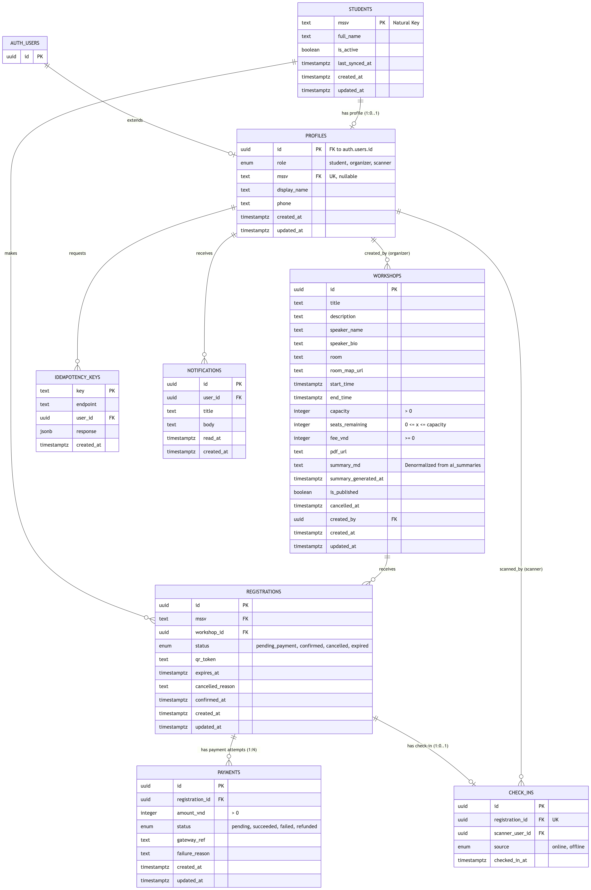

# UniHub Workshop — Technical Design

---

## Kiến trúc tổng thể

<!-- Mô tả architectural style được chọn và lý do.
     Hệ thống gồm những thành phần nào? Chúng giao tiếp với nhau như thế nào? -->

UniHub Workshop được xây dựng theo kiểu **Modular Monolith** — một đơn vị triển khai duy nhất, bên trong chia thành các module có ranh giới rõ ràng. Lựa chọn này phù hợp với quy mô dự án nhỏ, không có yêu cầu scale-out độc lập từng module. Microservices bị loại vì overhead vận hành (service discovery, distributed tracing) chiếm 30–40% thời gian mà không mang lại giá trị tương xứng (áp dụng YAGNI). Peer-to-Peer cũng không phù hợp vì hệ thống cần kiểm soát tập trung cho RBAC và seat reservation nhất quán.

Bên trong Modular Monolith, mỗi phần áp dụng một phong cách kiến trúc riêng phù hợp với đặc thù của nó:

| Phần hệ thống | Phong cách | Lý do |
|---|---|---|
| Giao tiếp client ↔ server | Client-Server | Web/PWA + REST stateless |
| Backend core | Layered | 4 tầng: routes → services → repositories → database |
| Gửi thông báo | Event-based | Giảm coupling, dễ bổ sung kênh mới (Telegram, v.v.) |
| Nhập dữ liệu CSV | Batch Sequential | ETL chạy định kỳ, không cần streaming |
| Tạo tóm tắt AI | Pipe-and-Filter | PDF → trích văn bản → làm sạch → chunk → LLM → lưu |

### Cấu trúc backend

Backend Express áp dụng kiến trúc Layered 4 tầng, mỗi tầng chỉ phụ thuộc vào tầng ngay dưới nó:

| Tầng | Vai trò | Thành phần |
|---|---|---|
| Trình bày | Nhận request, kiểm tra đầu vào, trả response | Express routes |
| Nghiệp vụ | Chứa rule nghiệp vụ, điều phối use case | Services |
| Adapter | Định nghĩa và implement interface | Interfaces + adapters |
| Truy cập dữ liệu | Truy vấn và ghi dữ liệu | Repositories + Supabase client |

### Phân chia module

Layered chia theo chiều ngang (tầng); để 3 thành viên làm song song không xung đột, hệ thống chia thêm theo chiều dọc thành 8 bounded context. Mỗi bounded context sở hữu routes, service và repository riêng — không module nào truy cập trực tiếp dữ liệu của module khác.

```
                       VERTICAL (bounded contexts)
       ┌──────────┬──────────┬─────────┬─────────┬──────────┬─────────┐
       │ Catalog  │ Registr. │ Payment │ Checkin │ Notify   │ AI/CSV/ │
       │          │          │         │         │          │ Identity│
H ─────┼──────────┼──────────┼─────────┼─────────┼──────────┼─────────┤
O   R  │ /api/v1/ │ /api/v1/ │ /api/v1/│/api/v1/ │ /api/v1/ │ /api/v1/│
R   O  │workshops │  regist. │payments │checkins │notify    │csv,ai   │
I   U  ├──────────┼──────────┼─────────┼─────────┼──────────┼─────────┤
Z   T  │ Service  │ Service  │ Service │ Service │ Service  │ Service │
O   E  │ (query   │ (seat    │ (CB +   │ (sync   │(EventEm. │ (batch+ │
N   S  │  + cache)│  reserv.)│ idem.)  │  logic) │ + outbox)│ pipeline)│
T      ├──────────┼──────────┼─────────┼─────────┼──────────┼─────────┤
A   D  │ Repo     │ Repo     │ Repo    │ Repo    │ Repo     │ Repo    │
L   B  │workshops │regist.   │idem_keys│check_ins│notif.    │students │
       │          │          │         │conflicts│          │csv_logs │
       └──────────┴──────────┴─────────┴─────────┴──────────┴─────────┘

Cross-cutting middleware (chạy trước routes của mọi module):
  • Auth + RBAC (JWT verify, role check)
  • Rate Limit (Token Bucket)
  • Idempotency (chỉ áp cho POST /registrations, /payments)
  • Logger + Error handler
```

| Module | Trách nhiệm chính | Phong cách |
|---|---|---|
| Catalog | Xem/tìm kiếm workshop, query số chỗ, cache | Layered |
| Registration | Đặt chỗ atomic, tạo mã QR, phát sự kiện | Layered |
| Payment | Thanh toán mock gateway, circuit breaker, idempotency | Layered |
| Notification | Nhận sự kiện, gửi thông báo in-app + email | Event-based |
| Checkin | Xác thực mã QR, đồng bộ check-in ngoại tuyến, ghi log xung đột | Layered |
| Identity & Access | Đăng nhập (Supabase Auth), xác thực JWT, ánh xạ role | Layered |
| DataSync | Đọc CSV (cron 02:00) → kiểm tra → chuyển đổi → upsert sinh viên | Batch Sequential |
| AI Summary | PDF → trích văn bản → làm sạch → chunk → LLM → gộp → lưu | Pipe-and-Filter |

### Giao tiếp giữa các thành phần

Các module giao tiếp qua đúng 2 kênh, không có ngoại lệ. Kênh thứ nhất là **gọi trực tiếp đồng bộ** trong cùng một request — dùng khi cần kết quả ngay (ví dụ: Registration gọi Payment khi người dùng bấm thanh toán). Kênh thứ hai là **EventEmitter bất đồng bộ** kiểu fire-and-forget — dùng khi không cần đợi kết quả và muốn tách coupling (ví dụ: Registration phát sự kiện `RegistrationConfirmed`, Notification lắng nghe và gửi email mà không làm chậm response trả về người dùng).

Ranh giới giữa nghiệp vụ và hạ tầng được giữ chặt theo mô hình Ports & Adapters. Tầng nghiệp vụ (services/) chỉ phụ thuộc vào TypeScript interface (port) như `IPaymentGateway`, `INotifier`, `IWorkshopRepository` — không import trực tiếp bất kỳ thư viện hạ tầng nào (Supabase, OpenAI, nodemailer). Các adapter implement port bằng công nghệ cụ thể và được đăng ký vào DI container lúc khởi động.

Một quy tắc bắt buộc: service của module A không được import repository của module B. Nếu Catalog cần biết sinh viên đã đăng ký workshop nào, phải gọi `registrationService.findByStudent()`, không query trực tiếp bảng `registrations`. Quy tắc này giữ ranh giới module rõ ràng — nếu sau này cần tách microservice, phạm vi refactor sẽ chỉ nằm trong đúng module đó.

---

## C4 Diagram

### Level 1 — System Context


### Level 2 — Container


## High-Level Architecture Diagram


---

## Thiết kế cơ sở dữ liệu

### Lựa chọn database

**PostgreSQL (Supabase cloud)**

Lý do: dữ liệu có quan hệ chặt chẽ, cần ACID cho seat reservation, cần JOIN cho dashboard thống kê, Supabase cung cấp thêm Auth, RLS, Realtime, Storage miễn phí trên free tier.

### Schema


---

## Thiết kế kiểm soát truy cập

<!-- Mô hình phân quyền, các nhóm người dùng, cách kiểm tra quyền tại từng điểm truy cập -->

### Mô hình: RBAC thuần

Hệ thống có 3 role cố định. Đề bài gợi ý RBAC và nhóm chọn RBAC, không dùng ABAC vì không có yêu cầu policy động (ví dụ "chỉ sinh viên khoa X đăng ký workshop khoa X") — setup ABAC engine (Casbin/OPA) tốn 2–3 ngày với ROI bằng 0 cho 3 role tĩnh.

**Single committee:** mọi organizer ngang quyền trên mọi workshop. Không có ownership check, không có `created_by`, không có `FORBIDDEN_OWNERSHIP`.

### Nhóm người dùng và quyền hạn

| Hành động | Endpoint | student | organizer | staff | anon |
|---|---|---|---|---|---|
| Xem danh sách workshop | `GET /api/v1/workshops` | ✓ | ✓ | ✓ | ✓ |
| Xem chi tiết workshop đã publish | `GET /api/v1/workshops/:id` | ✓ | ✓ | ✓ | ✓ |
| Xem workshop chưa publish | `GET /api/v1/workshops/:id` | ✗ | ✓ | ✗ | ✗ (trả 404) |
| Tạo workshop | `POST /api/v1/workshops` | ✗ | ✓ | ✗ | ✗ |
| Sửa workshop | `PATCH /api/v1/workshops/:id` | ✗ | ✓ | ✗ | ✗ |
| Huỷ workshop | `DELETE /api/v1/workshops/:id` | ✗ | ✓ | ✗ | ✗ |
| Đăng ký workshop | `POST /api/v1/registrations` | ✓ (chỉ cho mình) | ✗ | ✗ | ✗ |
| Xem đăng ký của mình | `GET /api/v1/registrations/me` | ✓ | — | — | ✗ |
| Xem toàn bộ đăng ký | `GET /api/v1/admin/registrations` | ✗ | ✓ | ✗ | ✗ |
| Quét QR check-in | `POST /api/v1/check-ins` | ✗ | ✓ | ✓ | ✗ |
| Xem thống kê | `GET /api/v1/admin/stats` | ✗ | ✓ | ✗ | ✗ |
| Upload PDF + gen AI summary | `POST /api/v1/workshops/:id/summary` | ✗ | ✓ | ✗ | ✗ |
| Trigger import CSV | `POST /api/v1/admin/csv-import` | ✗ | ✓ | ✗ | ✗ |

Quy ước: ✓ cho phép, ✗ từ chối (403), — không áp dụng cho role này.

**Lưu ý 404 vs 403:** khi anon/student truy cập workshop chưa publish, hệ thống trả 404 thay vì 403 để không leak sự tồn tại của resource (information disclosure).

**Role assignment:** `role` lưu ở `profiles.role` (Postgres). `loadProfile` middleware query DB mỗi request — không đọc từ JWT claim để revoke có hiệu lực ngay. Admin cấp role bằng UPDATE trực tiếp bảng `profiles`. Không có self-signup lên role cao hơn.

### Cách kiểm tra quyền tại từng điểm truy cập

**Kiến trúc 2 lớp — source of truth là lớp 1:**

| Lớp | Cơ chế | Áp cho |
|-----|--------|--------|
| **Lớp 1 — chính:** Express middleware | Verify JWT → load profile → check role | Mọi request đến `/api/v1/*` |
| **Lớp 2 — phụ:** Supabase RLS | Deny-all mặc định + 2 policy public | Chỉ 2 bảng FE chạm trực tiếp (`workshops`, `profiles`) |

Backend Express dùng `SUPABASE_SERVICE_ROLE_KEY` để bypass RLS cho mọi query nghiệp vụ. Mọi quyết định phân quyền do middleware Lớp 1 thực hiện — không duplicate logic xuống RLS. RLS Lớp 2 chỉ là safety net cho Realtime và Supabase JS FE gọi trực tiếp.

**Tại sao không full defense-in-depth (RLS toàn bộ):** nếu logic quyền duplicate ở 2 chỗ, sửa middleware mà quên RLS (hoặc ngược lại) sinh bug 403/500 khó trace. MVP 2 ngày không đủ thời gian test đầy đủ ma trận quyền × 8 bảng.

**4 middleware xếp thành chain, áp theo route:**

```typescript
// backend/src/middleware/auth.ts
verifyJwt          // 1. parse Authorization header → req.user.id
loadProfile        // 2. SELECT profiles → req.user.role, req.user.mssv
requireRole(roles) // 3. role không trong whitelist → 403 FORBIDDEN_ROLE
```

Ví dụ áp cho route sửa workshop:

```typescript
router.patch('/api/v1/workshops/:id',
  verifyJwt,
  loadProfile,
  requireRole(['organizer']),
  workshopController.update
);
```

**Lý do `loadProfile` query DB mỗi request (không dùng JWT claim):** revoke role có hiệu lực ngay, không phải đợi JWT expire (mặc định Supabase 1 giờ). Trade-off: 1 DB round-trip thêm mỗi request — chấp nhận ở MVP single-instance; production scale-out thì cache role 60s trong Redis.

**Kịch bản lỗi và HTTP status:**

| Tình huống | HTTP | Error code |
|---|---|---|
| Không có Authorization header | 401 | `UNAUTHENTICATED` |
| JWT sai định dạng / signature | 401 | `INVALID_TOKEN` |
| JWT hết hạn | 401 | `TOKEN_EXPIRED` |
| Profile không tồn tại trong DB | 401 | `PROFILE_NOT_FOUND` |
| Role không đủ | 403 | `FORBIDDEN_ROLE` |
| Resource không tồn tại | 404 | `RESOURCE_NOT_FOUND` |

### RLS minimal (Lớp 2)

Chỉ 2 bảng FE chạm trực tiếp có policy:

```sql
-- workshops: public read khi đã publish và chưa cancel
ALTER TABLE workshops ENABLE ROW LEVEL SECURITY;
CREATE POLICY workshops_read_public ON workshops
  FOR SELECT USING (is_published = true AND cancelled_at IS NULL);

-- profiles: user đọc/sửa chính mình
ALTER TABLE profiles ENABLE ROW LEVEL SECURITY;
CREATE POLICY profiles_read_self ON profiles FOR SELECT USING (id = auth.uid());
CREATE POLICY profiles_update_self ON profiles FOR UPDATE
  USING (id = auth.uid()) WITH CHECK (id = auth.uid());
```

6 bảng còn lại bật RLS nhưng không tạo policy → deny-all với anon/authenticated key; backend bypass qua `service_role`:

```sql
ALTER TABLE registrations   ENABLE ROW LEVEL SECURITY;
ALTER TABLE check_ins       ENABLE ROW LEVEL SECURITY;
ALTER TABLE payments        ENABLE ROW LEVEL SECURITY;
ALTER TABLE idempotency_keys ENABLE ROW LEVEL SECURITY;
ALTER TABLE notifications   ENABLE ROW LEVEL SECURITY;
ALTER TABLE students        ENABLE ROW LEVEL SECURITY;
-- (không CREATE POLICY → mặc định deny all)
```

---

## Thiết kế các cơ chế bảo vệ hệ thống

### Kiểm soát tải đột biến — Rate Limiting

**Giải pháp:** `express-rate-limit` với in-memory store, thuật toán **Token Bucket**.

Token Bucket cho phép burst ngắn hạn (phù hợp "60% trong 3 phút đầu") đồng thời chặn client gửi liên tục khi vượt ngưỡng.

**Cấu hình 2 lớp:**

| Lớp | Route | Giới hạn | Hành vi khi vượt |
|------|-------|----------|-----------------|
| Global | `/api/v1/*` | 200 req / 15 phút / IP | 429 + `Retry-After` header |
| Critical | `POST /api/v1/registrations` | 20 req / phút / IP | 429 `{ code: "RATE_LIMIT_EXCEEDED" }` |

Ngưỡng critical chọn 20 req/min (thay vì 10) vì bottleneck thật sự là row-level lock tại DB — rate limit chỉ cần shed excess burst, không cần chặt đến mức gây 429 oan cho user retry hợp lệ. Hành vi FE thực tế: network lag → retry 3 lần + user bấm lại 2 lần = ~5 req trong 10–20 giây; ngưỡng 10 quá gần, 20 cho biên an toàn hơn.

**Lưu ý về DB load ẩn:** middleware `loadProfile` chạy trước mọi route có auth → mỗi request authenticated thêm 1 SELECT vào bảng `profiles`. Rate limit 200 req/15min/IP kiểm soát tần suất từ client, nhưng DB thực tế nhận gấp đôi số query so với con số rate limit biểu thị (1 SELECT profiles + 1 business query). Cần tính điều này khi đọc ngưỡng capacity.

**Luồng trạng thái:**

```
Request → [Token Bucket]
              │
         ≥1 token?
         ┌───┴────┐
        YES       NO
         │         │
    consume      429 Too
    1 token    Many Requests
         │
    next()
```

**Giới hạn:** Memory store không persistent qua restart, không scale-out (mỗi instance đếm riêng). Chấp nhận cho MVP single-instance.

---

### Xử lý cổng thanh toán không ổn định — Circuit Breaker

**Giải pháp:** thư viện `opossum`, wrap `MockPaymentGateway.charge()`.

**Cấu hình:**

- `timeout`: 3000 ms
- `errorThresholdPercentage`: 50 (open khi 50% request fail)
- `resetTimeout`: 30000 ms (chuyển half-open sau 30s)

**State machine:**

```
           ┌─────────────── CLOSED ───────────────┐
           │  (hoạt động bình thường)              │
           │  errorRate < 50% → giữ CLOSED         │
           │  errorRate ≥ 50% → chuyển OPEN        │
           └──────────────────────────────────────►│
                                                   ▼
                                               OPEN
                                    (reject ngay, không gọi service)
                                    Hành vi: trả 503 thân thiện,
                                    reservation → pending_payment 15 phút
                                               │
                                    sau 30s → ▼
                                           HALF-OPEN
                                    (cho 1 request thử)
                                    ┌──────────┴──────────┐
                                   OK                   FAIL
                                    │                     │
                                    ▼                     ▼
                                 CLOSED                 OPEN
```

**Graceful degradation khi Open:**

- Tính năng xem lịch, tìm kiếm workshop → **không bị ảnh hưởng**.
- Đăng ký miễn phí → **không bị ảnh hưởng** (không qua payment gateway).
- Đăng ký có phí → reservation giữ trạng thái `pending_payment`, TTL 15 phút. Cron job tự release seat sau 15 phút nếu payment không hoàn thành.
- Trả response: `{ error: { code: "PAYMENT_UNAVAILABLE", message: "Thanh toán tạm thời không khả dụng. Chỗ được giữ 15 phút, vui lòng thử lại sau." } }`

---

### Seat Reservation — Pessimistic Locking implicit qua Atomic UPDATE

**Giải pháp:** một câu UPDATE atomic với WHERE clause kiểm tra điều kiện. Không dùng `SELECT ... FOR UPDATE` thủ công.

```sql
UPDATE workshops
SET seats_remaining = seats_remaining - 1
WHERE id = $1 AND seats_remaining > 0
RETURNING seats_remaining;
```

**Tại sao đây vẫn là pessimistic locking:** Postgres row-level lock được nắm ngay khi UPDATE chạm row, giữ đến hết transaction. Hai request đến cùng millisecond sẽ bị serialize tại row lock — chỉ 1 request thấy `seats_remaining > 0`, request thứ 2 đợi, đọc giá trị đã giảm.

**Tại sao không dùng `BEGIN; SELECT ... FOR UPDATE; UPDATE; COMMIT;`:** Pattern rườm rà : 4 round-trip thay vì 1, cùng level isolation. Câu UPDATE đơn lẻ ngắn gọn hơn, ít chỗ sai hơn. Vẫn wrap trong transaction nếu cần INSERT registration cùng lúc:

```typescript
async function reserveSeat(workshopId: string, studentId: string, idempotencyKey: string) {
  return db.transaction(async (tx) => {
    // Step 1: atomic decrement — pessimistic lock implicit
    const result = await tx.query(`
      UPDATE workshops
      SET seats_remaining = seats_remaining - 1
      WHERE id = $1 AND seats_remaining > 0
      RETURNING seats_remaining
    `, [workshopId])

    if (result.rowCount === 0) {
      throw new SeatsSoldOutError('Workshop đã hết chỗ')
    }

    // Step 2: insert registration. UNIQUE(student_id, workshop_id) chống đăng ký 2 lần.
    try {
      await tx.query(`
        INSERT INTO registrations (student_id, workshop_id, status, idempotency_key, qr_token)
        VALUES ($1, $2, 'pending_payment', $3, $4)
      `, [studentId, workshopId, idempotencyKey, generateQrToken()])
    } catch (err) {
      if (err.code === '23505') {
        // PK violation — SV đã đăng ký workshop này rồi
        // Rollback transaction → atomic UPDATE seats_remaining cũng rollback (chỗ trả về)
        throw new AlreadyRegisteredError('Bạn đã đăng ký workshop này')
      }
      throw err
    }

    return { qrToken: result.rows[0].qr_token, seatsRemaining: result.rows[0].seats_remaining }
  })
}
```

**Tại sao chọn pessimistic thay vì optimistic:** Với 7.200 request / 3 phút tranh 60 chỗ (xác suất conflict gần 100% với chỗ cuối), optimistic sẽ gây retry storm — mỗi request fail phải retry, retry lại conflict, lặp đến khi hết chỗ. Pessimistic deterministic: 60 request đầu thắng, 7.140 request sau nhận lỗi "đã hết chỗ" tức thì. Optimistic phù hợp với CRUD admin (workshop update), nơi conflict rate < 1% — xem ADR-004.

**Compensating action khi payment fail:** Reservation insert với `status='pending_payment'`. Payment gọi ngoài transaction (Saga pattern, không hold lock):

- Payment success → UPDATE status='confirmed'.
- Payment fail/timeout → UPDATE status='cancelled' + compensating UPDATE `seats_remaining = seats_remaining + 1` để release chỗ.
- Cron job mỗi phút quét `pending_payment` quá 15 phút → tự release seat.

---

### Chống trừ tiền hai lần — Idempotency Key

**Giải pháp:** bảng `idempotency_keys` trên PostgreSQL với pattern **INSERT ON CONFLICT** (atomic, race-condition-safe). Không dùng Redis (xem ADR-011).

**Vấn đề idempotency giải quyết:** Khi mạng lag, user bấm "Thanh toán" 3 lần — backend nhận 3 HTTP request riêng biệt với cùng intent. Mỗi request mở transaction riêng → 3 lần charge + 3 row registration. Database transaction một mình không phát hiện được "đây là retry của cùng intent" vì nó chỉ thấy 3 request độc lập.

**Cách hoạt động:**

```
Client (FE)                          Express API                   PostgreSQL
    │                                     │                              │
    │  (bấm "Thanh toán" lần đầu)         │                              │
    │  key = crypto.randomUUID()          │                              │
    │  // lưu vào React state             │                              │
    │──── POST /registrations ───────────►│                              │
    │     Idempotency-Key: <key>          │                              │
    │                                     │── INSERT ON CONFLICT ───────►│
    │                                     │   (key, endpoint,            │
    │                                     │    status='in_progress')     │
    │                                     │◄── RETURNING row (ta thắng)──│
    │                                     │                              │
    │                                     │ [chạy business logic]        │
    │                                     │                              │
    │                                     │── UPDATE status='done', ────►│
    │                                     │   response=$body             │
    │◄─── 200 { qr_token: ... } ──────────│                              │
    │                                     │                              │
    │  (mạng lag, user bấm lần 2)         │                              │
    │──── POST /registrations ───────────►│                              │
    │     Idempotency-Key: <SAME key>     │                              │
    │                                     │── INSERT ON CONFLICT ───────►│
    │                                     │◄── RETURNING rỗng (conflict)─│
    │                                     │── SELECT status, response ──►│
    │                                     │◄── status='done', response ──│
    │◄─── 200 { qr_token: ... } ──────────│ (trả cached, không chạy lần 2)
```

**Middleware đúng (atomic, không có race):**

```typescript
async function idempotencyMiddleware(req, res, next) {
  const key = req.headers['idempotency-key']
  if (!key) {
    return res.status(400).json({ error: { code: 'IDEMPOTENCY_KEY_REQUIRED' } })
  }

  // Atomic INSERT: nếu key đã có → CONFLICT, RETURNING rỗng
  // Nếu key mới → INSERT thành công, RETURNING row.
  // Hai request retry đến cùng micro-second: Postgres serialize qua PK, chỉ 1 request được nhận.
  const insert = await db.query(`
    INSERT INTO idempotency_keys (key, endpoint, status)
    VALUES ($1, $2, 'in_progress')
    ON CONFLICT (key, endpoint) DO NOTHING
    RETURNING key
  `, [key, req.path])

  if (insert.rows.length === 0) {
    // Đã có request khác nắm key này -> retry hoặc duplicate
    const existing = await db.query(
      `SELECT status, response FROM idempotency_keys WHERE key = $1 AND endpoint = $2`,
      [key, req.path]
    )
    const row = existing.rows[0]
    if (row.status === 'in_progress') {
      // Request gốc đang chạy -> trả 409 để client biết retry sau
      return res.status(409).json({ error: { code: 'REQUEST_IN_PROGRESS' } })
    }
    // status='done' -> trả response đã cache
    return res.json(row.response)
  }

  // Ta là người đầu tiên -> chạy handler, cập nhật status sau khi response.
  // Proxy res.json để capture body và UPDATE status='done'.
  const originalJson = res.json.bind(res)
  res.json = (body) => {
    db.query(
      `UPDATE idempotency_keys SET status='done', response=$3 WHERE key=$1 AND endpoint=$2`,
      [key, req.path, JSON.stringify(body)]
    ).catch(err => logger.warn('idempotency UPDATE failed', err))
    return originalJson(body)
  }
  next()
}
```

**Tại sao INSERT trước, không SELECT trước:** Pattern naive *"SELECT, nếu rỗng thì xử lý + INSERT"* có race condition — 2 request retry đến cùng millisecond, cả 2 đều SELECT rỗng, cả 2 cùng xử lý -> cùng charge 2 lần, rồi cùng INSERT (1 fail PK violation, nhưng *side effect payment đã xảy ra 2 lần rồi*). INSERT ON CONFLICT là single atomic operation — Postgres đảm bảo chỉ 1 request thắng qua PK constraint.

**TTL:** 24 giờ. Không cần job dọn dẹp ở MVP vì bảng tăng chậm (~hàng nghìn row/ngày).

**Client phía FE:** tạo `crypto.randomUUID()` lúc user bấm nút *lần đầu*, lưu trong React state. Mỗi lần retry trong cùng phiên dùng *cùng* key đó. Reload trang -> key mới.

---

## Các quyết định kỹ thuật quan trọng (ADR)

| ADR | Quyết định | Slide nguồn chính | Yêu cầu |
|-----|-----------|-------------------|---------|
| **001** | Modular Monolith (Layered + Event-based + Batch Sequential) | Software Architecture, slide 18–31 | Đội 3 người, 2 ngày, tổng thể hệ thống |
| **002** | PostgreSQL duy nhất (Supabase), không polyglot | Lựa chọn CSDL, slide 4 | Seat consistency, RLS, JOIN dashboard |
| **003** | Strong consistency cho seat + payment; Eventual cho display + notification | Lựa chọn CSDL, slide 38–40 | CAP trade-off per-feature |
| **004** | Pessimistic locking implicit qua atomic UPDATE cho seat reservation | Lựa chọn CSDL, slide 35 | Double-booking = 0 |
| **005** | Service interface trước implementation (DIP/OCP/ISP) | Nguyên Lý TKPM, slide 14–37 | Notification plug-in, payment swap |
| **006** | Rate limiting — Token Bucket, `express-rate-limit`, memory store | requirement.md, mục 7 | 12.000 user / 10 phút |
| **007** | Circuit Breaker — `opossum`, Closed/Open/Half-Open | requirement.md, mục 7 | Payment gateway down |
| **008** | Idempotency Key — PostgreSQL table, TTL 24h | requirement.md, mục 7 | Chống double-charge |
| **009** | PWA + IndexedDB + Foreground Sync (bỏ Background Sync API) | requirement.md, mục Check-in | 0% data loss offline, iOS Safari |
| **010** | RBAC 2-layer (Express middleware + Supabase RLS) | requirement.md, mục 6 | 3 roles, kiểm soát chặt |
| **011** | Không dùng Redis ở MVP — Postgres làm tất | YAGNI; đội 3 người | Idempotency, rate limit, cache đều giải được bằng Postgres + in-memory |
| **012** | Outbox pattern cho notification (table `notifications.status`) | requirement.md mục Thông báo | At-least-once delivery, không mất khi BE crash |
| **013** | CSV import qua scheduled job (cron), không upload UI | requirement.md mục Đồng bộ | Đề viết rõ "export theo lịch cố định" và "định kỳ nhập dữ liệu" — automated nightly batch |

### Chi tiết ADR-011: Không dùng Redis ở MVP

**Context:** 12K user / 10 phút, single Supabase instance, đội 3 người, timeline 1 tuần. Có 4 use case kinh điển của Redis cần xem xét:

| Use case Redis | UniHub có cần? | Giải pháp Postgres/Supabase thay thế |
|----------------|----------------|--------------------------------------|
| Caching read-heavy | Có (catalog 12K view) | In-memory JS Map TTL 5s trong Node.js (single instance đủ) |
| Distributed lock | Không (single BE) | Atomic UPDATE + advisory lock của Postgres |
| Rate limit shared state | Không (single BE) | `express-rate-limit` memory store |
| Pub/sub realtime | Có (số chỗ realtime) | Supabase Realtime (built-in) |

**Decision:** không thêm Redis. Postgres + in-memory + Supabase Realtime đủ.

**Consequences:**

- (+) Giảm 1 service phải vận hành, monitor, backup, secure.
- (+) Một nguồn truth (Postgres) — không có data drift cache ↔ DB.
- (+) Đội 3 người không mất time tune Redis.
- (-) Khi scale-out ≥ 2 BE instance, rate limit memory store đếm riêng → user có thể vượt limit qua các instance khác. Migration cost ~1 ngày: dùng `rate-limit-postgresql` hoặc thêm Upstash Redis.
- (-) Cache in-memory mất khi BE restart. Acceptable vì warm-up < 1s.

**Trigger để revisit:** (1) chuyển sang ≥ 2 BE instance, hoặc (2) latency P99 catalog read > 100ms ổn định, hoặc (3) cần background job persistent (BE crash không mất job).

### Quyết định KHÔNG triển khai (YAGNI)

Các lựa chọn dưới đây được **hiểu và cân nhắc**, nhưng không implement:

- Sharding / Read replica: single Supabase instance đủ
- Redis distributed cache: in-memory đủ cho single instance
- Kafka / RabbitMQ / BullMQ: Node EventEmitter in-process đủ
- Microservices / Service mesh: overhead vượt capacity đội
- Background Sync API: iOS Safari không support
- Real payment gateway / email provider: mock đủ chứng minh design
- Telegram notifier implementation: interface đủ chứng minh OCP
- Two-Phase Commit: release seat khi payment fail thay thế
