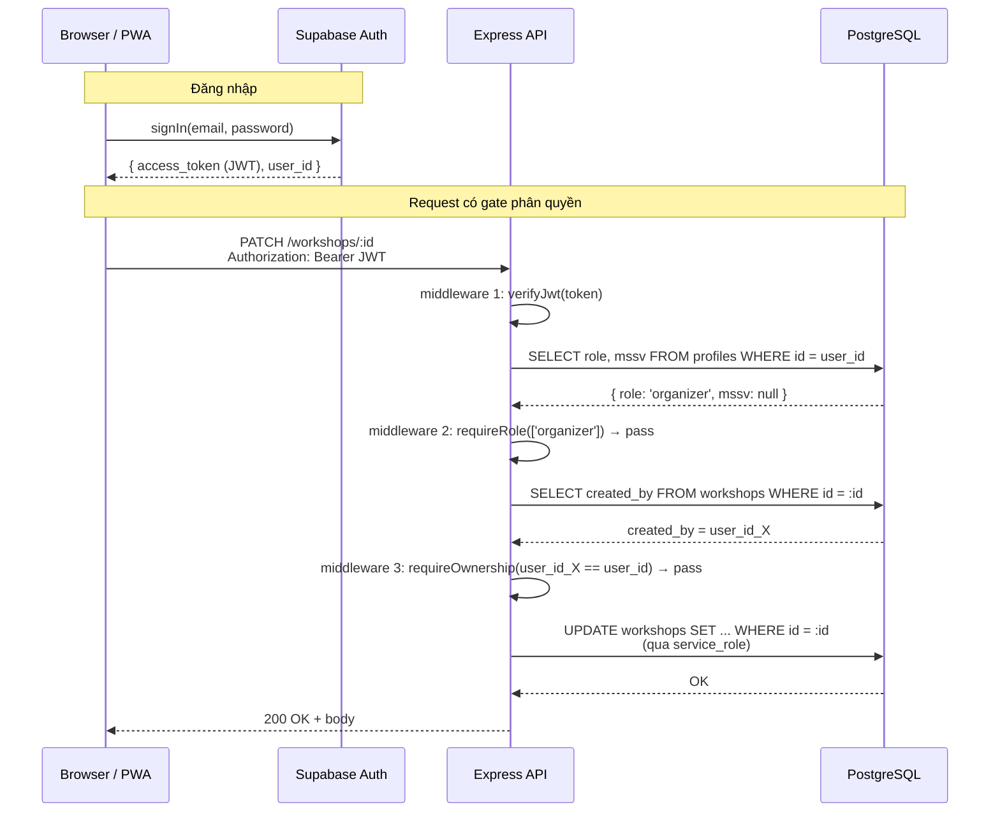

# Đặc tả: Cơ chế phân quyền

> Trace về `requirement.md` mục 6 ("Thiết kế kiểm soát truy cập") và `docs/architecture-decisions.md` mục ADR-010.
>
> **Nhóm 16** — Đào Hoàng Đức Mạnh, Nguyễn Trần Minh Thư, Phạm Anh Hào

---

## 1. Mô tả

Hệ thống có 3 nhóm người dùng với quyền hạn khác nhau, được mô tả nguyên văn trong đề bài:

> "Trang admin chỉ dành cho nội bộ và cần kiểm soát truy cập chặt chẽ — ba nhóm người dùng có quyền hạn khác nhau: sinh viên chỉ có thể xem và đăng ký workshop; ban tổ chức có quyền tạo, sửa, hủy workshop và xem thống kê; nhân sự check-in chỉ có quyền truy cập chức năng quét mã QR."

Đề bài gợi ý mô hình RBAC: "Nhóm có thể tham khảo mô hình **RBAC** (Role-Based Access Control) hoặc đề xuất cách tiếp cận khác nếu có lý do phù hợp."

---

## 2. Quyết định: RBAC + Ownership check (ABAC một thuộc tính)

### 2.1 Phân tích RBAC vs ABAC thuần

| Tiêu chí | RBAC | ABAC thuần |
|---|---|---|
| Số role cố định trong UniHub | 3 (student, organizer, scanner) | n/a |
| Quyền phụ thuộc thuộc tính động? | Không (1 ngoại lệ — xem 2.2) | Có |
| Yêu cầu policy engine (Casbin/OPA)? | Không | Có |
| Complexity setup (dev-day) | 0.5 ngày | 2-3 ngày |
| Đề bài có yêu cầu? | Có (gợi ý) | Không |

→ **Chọn RBAC**, không ABAC thuần. Lý do: đề chỉ có 3 role fixed, không có yêu cầu policy động kiểu "chỉ sinh viên trong khoa X được đăng ký workshop của khoa X" hay "scanner chỉ check-in trong khung giờ Y". ABAC sẽ tốn 2-3 ngày setup engine cho ROI = 0.

### 2.2 Ngoại lệ: ownership của workshop

Đề bài ghi: "ban tổ chức có quyền **tạo, sửa, hủy workshop** và xem thống kê." Đề KHÔNG nói rõ organizer A có được sửa workshop của organizer B hay không.

**Quyết định business của nhóm**: organizer chỉ được sửa/huỷ workshop **mình tạo ra**. Lý do:

- Tránh organizer ghi đè nhau khi cùng dùng admin panel.
- Audit dễ — mỗi workshop có 1 owner duy nhất.
- Khớp pattern thực tế của các sự kiện trường (mỗi khoa/CLB phụ trách workshop riêng).

Để tránh phức tạp hoá, tài liệu này gọi là **"RBAC + ownership check"**.

Implementation: kiểm tra `workshops.created_by = profiles.id của requester` ở **application layer (Express middleware)**, không dùng RLS. Lý do tách ra application layer xem mục 4.

---

## 3. Bảng quyền hạn (Permission Matrix)

| Hành động | Endpoint | student | organizer (owner) | organizer (non-owner) | scanner | anon |
|---|---|---|---|---|---|---|
| Xem danh sách workshop public | `GET /api/v1/workshops` | ✓ | ✓ | ✓ | ✓ | ✓ |
| Xem chi tiết workshop public | `GET /api/v1/workshops/:id` | ✓ | ✓ | ✓ | ✓ | ✓ |
| Xem workshop chưa publish | `GET /api/v1/workshops/:id` | ✗ | ✓ | ✓ | ✗ | ✗ |
| Tạo workshop | `POST /api/v1/workshops` | ✗ | n/a | n/a | ✗ | ✗ |
| Sửa workshop | `PATCH /api/v1/workshops/:id` | ✗ | ✓ | ✗ | ✗ | ✗ |
| Huỷ workshop | `DELETE /api/v1/workshops/:id` | ✗ | ✓ | ✗ | ✗ | ✗ |
| Đăng ký workshop | `POST /api/v1/registrations` | ✓ (chỉ cho mình) | ✗ | ✗ | ✗ | ✗ |
| Xem đăng ký của mình | `GET /api/v1/registrations/me` | ✓ | n/a | n/a | n/a | ✗ |
| Xem toàn bộ đăng ký | `GET /api/v1/admin/registrations` | ✗ | ✓ | ✓ | ✗ | ✗ |
| Quét QR check-in | `POST /api/v1/check-ins` | ✗ | ✓ | ✓ | ✓ | ✗ |
| Xem thống kê | `GET /api/v1/admin/stats` | ✗ | ✓ | ✓ | ✗ | ✗ |
| Upload PDF + gen AI summary | `POST /api/v1/workshops/:id/summary` | ✗ | ✓ | ✗ | ✗ | ✗ |
| Trigger import CSV | `POST /api/v1/admin/csv-import` | ✗ | ✓ | ✓ | ✗ | ✗ |

Quy ước:

- ✓ = cho phép. ✗ = từ chối (403). n/a = không áp dụng (role này không thể là chủ sở hữu).
- "owner" = `workshops.created_by = profiles.id của user`.

---

## 4. Kiến trúc kiểm soát: defense-in-depth NHẸ

### 4.1 Hai lớp kiểm tra

| Lớp | Cơ chế | Vai trò | Áp cho |
|---|---|---|---|
| **Lớp 1 — chính** | Express middleware | Verify JWT → decode role → check permission + ownership | MỌI request đến `/api/v1/*` |
| **Lớp 2 — phụ** | Supabase RLS policy | Backup khi FE gọi DB trực tiếp qua Supabase JS | Chỉ 2 bảng (xem 4.3) |

Source of truth = **Lớp 1**. Lớp 2 chỉ là safety net cho 2 bảng FE chạm trực tiếp.

### 4.2 Tại sao không full defense-in-depth (RLS toàn bộ)?

ADR-010 phiên bản đầu đề xuất "2-layer RBAC: middleware + RLS toàn bộ". Sau review, nhóm chốt cắt phần lớn RLS policy vì:

- **Duplicate logic 2 chỗ** → khi sửa quyền phải sửa cả 2; quên 1 nơi → 2 lớp lệch → bug 500/403 khó debug.
- **MVP 2 ngày không có thời gian test đầy đủ ma trận quyền × bảng**.
- **FE chủ yếu gọi Express API** (TanStack Query), Supabase JS chỉ dùng cho Auth + Realtime + Storage. Bảng FE chạm trực tiếp chỉ có 2: `workshops` (Realtime broadcast seats), `profiles` (lấy display_name).

→ Trade-off chấp nhận: nếu sau này FE gọi DB trực tiếp nhiều hơn (vd dashboard live), phải bật RLS policy bổ sung. Migration sau, không phải bây giờ.

### 4.3 RLS minimal

Bảng có policy:

```sql
-- workshops: public read khi đã publish + chưa cancel
alter table workshops enable row level security;
create policy workshops_read_public on workshops
  for select using (is_published = true and cancelled_at is null);

-- profiles: user đọc/sửa chính mình
alter table profiles enable row level security;
create policy profiles_read_self on profiles for select using (id = auth.uid());
create policy profiles_update_self on profiles for update
  using (id = auth.uid()) with check (id = auth.uid());
```

6 bảng còn lại (`students`, `registrations`, `payments`, `idempotency_keys`, `check_ins`, `notifications`):

```sql
alter table <bảng> enable row level security;
-- không tạo policy → mặc định deny all qua anon/authenticated key
```

Backend Express dùng `SUPABASE_SERVICE_ROLE_KEY` để bypass RLS. Mọi quyết định quyền do middleware Lớp 1 thực hiện.

---

## 5. Luồng kiểm tra quyền

### 5.1 Sequence diagram



### 5.2 Middleware chain

Ba middleware tách rời, áp dụng theo route:

```typescript
// backend/src/middleware/auth.ts
verifyJwt          // 1. parse Authorization header, set req.user.id
loadProfile        // 2. SELECT profile → set req.user.role, req.user.mssv
requireRole(roles) // 3. nếu req.user.role không nằm trong roles → 403
requireOwnership(  // 4. resource-specific check (workshop, registration, ...)
  resourceLoader,  //    fetch resource và so sánh ownership
  ownerField
)
```

Ví dụ apply cho route:

```typescript
router.patch('/workshops/:id',
  verifyJwt,
  loadProfile,
  requireRole(['organizer']),
  requireOwnership(loadWorkshop, 'created_by'),
  workshopController.update
);
```

Sinh viên tự đăng ký workshop của mình: chỉ cần `verifyJwt + loadProfile + requireRole(['student'])` (ownership = "mình đăng ký cho mình" được handle trong controller, không cần middleware riêng).

---

## 6. Kịch bản lỗi

| Tình huống | HTTP | Body |
|---|---|---|
| Không có Authorization header | 401 | `{ error: { code: 'UNAUTHENTICATED', message: 'Thiếu token' } }` |
| JWT sai định dạng / signature | 401 | `{ error: { code: 'INVALID_TOKEN' } }` |
| JWT hết hạn | 401 | `{ error: { code: 'TOKEN_EXPIRED' } }` — FE redirect login |
| JWT hợp lệ nhưng profile không tồn tại trong DB | 401 | `{ error: { code: 'PROFILE_NOT_FOUND' } }` — user đã bị xoá |
| Role không đủ (vd student gọi POST /workshops) | 403 | `{ error: { code: 'FORBIDDEN_ROLE', required: ['organizer'] } }` |
| Organizer A sửa workshop của organizer B | 403 | `{ error: { code: 'FORBIDDEN_OWNERSHIP' } }` |
| Resource không tồn tại | 404 | `{ error: { code: 'RESOURCE_NOT_FOUND' } }` — trả 404 thay vì 403 để KHÔNG leak info về resource tồn tại |

Ghi chú về 404 vs 403: theo nguyên tắc tránh information disclosure, nếu user không có quyền XEM một resource, hệ thống trả 404 thay vì 403 (giả vờ resource không tồn tại). Áp dụng cho workshop chưa publish khi student/anon truy cập.

---

## 7. Ràng buộc

- **Stateless authentication**: JWT là source of truth, không có server-side session store. Đổi role → user phải đăng xuất + đăng nhập lại để token mới có claim role mới (hoặc đợi token expire, default Supabase 1 giờ).
- **Profile lookup mỗi request**: middleware `loadProfile` query DB mỗi lần để lấy role hiện tại — chấp nhận DB round-trip để có khả năng revoke role tức thì (nếu nhúng role vào JWT thì revoke phải đợi expire). MVP single-instance, latency không đáng kể; production scale-out → cache role 60s trong Redis.
- **Service role key** chỉ tồn tại trong `.env` của Express, KHÔNG bao giờ expose ra FE. Leak ra FE = compromise toàn bộ DB → emergency rotate.
- **Ownership scope cứng**: organizer chỉ owner của workshop, không có concept "co-owner" hoặc "transfer ownership". Nếu cần (organizer nghỉ việc) → admin thao tác trực tiếp DB (out-of-scope MVP).

---

## 8. Tiêu chí chấp nhận

Test cases để verify spec hoạt động đúng (Vitest):

1. **Anon truy cập endpoint cần auth** → 401 (không phải 403).
2. **Student gọi `POST /workshops`** → 403 với `code: FORBIDDEN_ROLE`.
3. **Scanner gọi `POST /workshops`** → 403.
4. **Organizer A tạo workshop X → organizer B gọi `PATCH /workshops/X`** → 403 với `code: FORBIDDEN_OWNERSHIP`.
5. **Organizer A gọi `PATCH /workshops/X` của chính mình** → 200.
6. **Student gọi `GET /registrations/me`** → trả về CHỈ registration của student đó (không leak của người khác).
7. **JWT hết hạn (giả lập)** → 401 với `code: TOKEN_EXPIRED`.
8. **Anon gọi `GET /workshops`** → 200, chỉ trả workshop `is_published = true AND cancelled_at IS NULL`.
9. **Anon gọi `GET /workshops/:id` cho workshop chưa publish** → 404 (giấu sự tồn tại).
10. **Bypass middleware bằng cách gọi Supabase JS trực tiếp** đọc bảng `payments` → 0 rows (RLS deny-all).

---

## 9. Trade-offs & alternatives đã loại

### Loại: ABAC thuần (Casbin / OPA / Cedar)

- Setup policy engine: 1-2 ngày.
- DSL học mới: 0.5 ngày.
- ROI cho 3 role fixed = âm.
- → Loại. Quay lại nếu sau này có yêu cầu policy động (vd: "workshop chuyên ngành A chỉ sinh viên khoa A đăng ký được").

### Loại: RLS toàn bộ (defense-in-depth strict)

- Mọi quyền duplicate ở 2 chỗ (middleware + RLS).
- Risk lệch giữa 2 lớp khi sửa.
- Test matrix nhân đôi.
- → Loại. Giữ RLS chỉ cho 2 bảng FE chạm trực tiếp.

### Loại: JWT chứa role + ownership claim (không query DB)

- Performance tốt hơn (no DB round-trip per request).
- Nhưng: đổi role không có hiệu lực ngay, phải đợi token expire.
- Ownership claim bị stale ngay khi workshop được transfer (out-of-scope nhưng vẫn là risk).
- → Loại. Chấp nhận DB lookup, cache khi cần scale.

### Out-of-the-box recommendation (cho version sau)

Nếu sau này cần linh hoạt hơn mà chưa đến mức ABAC engine: **Supabase Auth Custom Claims + RLS**. Lưu role vào JWT claim qua Auth Hook (Postgres function `auth.hook_custom_access_token`), RLS đọc claim bằng `auth.jwt() ->> 'role'`. Lợi: query DB 0 lần cho việc check role, vẫn revoke được qua refresh token. ROI khi traffic vượt 1K req/min — chưa cần cho MVP.

---

## 10. Mapping → ADR & slide môn học

| Quyết định trong spec này | Trace về |
|---|---|
| Chọn RBAC, không ABAC | `requirement.md` mục 6 + slide #10 (RBAC vs ABAC) |
| Ownership = ABAC 1-attribute | `docs/architecture-decisions.md` ADR-010 |
| Middleware Express là source of truth | ADR-005 (Service interface trước, implementation sau) |
| RLS minimal 2 bảng | ADR-002 (PostgreSQL Supabase) + ADR-010 |
| JWT stateless + DB lookup role | ADR-001 (Modular Monolith Layered) |

---

## Phụ lục A — Snippet middleware tham khảo

```typescript
// backend/src/middleware/auth.ts
import { createClient } from '@supabase/supabase-js';
import type { Request, Response, NextFunction } from 'express';

const supabaseAdmin = createClient(
  process.env.SUPABASE_URL!,
  process.env.SUPABASE_SERVICE_ROLE_KEY!
);

export async function verifyJwt(req: Request, res: Response, next: NextFunction) {
  const token = req.headers.authorization?.replace(/^Bearer\s+/i, '');
  if (!token) return res.status(401).json({ error: { code: 'UNAUTHENTICATED' } });

  const { data, error } = await supabaseAdmin.auth.getUser(token);
  if (error || !data.user) return res.status(401).json({ error: { code: 'INVALID_TOKEN' } });

  req.user = { id: data.user.id };
  next();
}

export async function loadProfile(req: Request, res: Response, next: NextFunction) {
  const { data, error } = await supabaseAdmin
    .from('profiles')
    .select('role, mssv, display_name')
    .eq('id', req.user.id)
    .single();
  if (error || !data) return res.status(401).json({ error: { code: 'PROFILE_NOT_FOUND' } });

  Object.assign(req.user, data);
  next();
}

export function requireRole(roles: ('student' | 'organizer' | 'scanner')[]) {
  return (req: Request, res: Response, next: NextFunction) => {
    if (!roles.includes(req.user.role)) {
      return res.status(403).json({
        error: { code: 'FORBIDDEN_ROLE', required: roles }
      });
    }
    next();
  };
}

export function requireOwnership<T>(
  loader: (id: string) => Promise<T | null>,
  ownerField: keyof T
) {
  return async (req: Request, res: Response, next: NextFunction) => {
    const resource = await loader(req.params.id);
    if (!resource) return res.status(404).json({ error: { code: 'RESOURCE_NOT_FOUND' } });
    if (resource[ownerField] !== req.user.id) {
      return res.status(403).json({ error: { code: 'FORBIDDEN_OWNERSHIP' } });
    }
    (req as any).resource = resource;  // reuse trong controller
    next();
  };
}
```

---

## Phụ lục B — Bảng tóm tắt 1 dòng

> **RBAC** với 3 role cố định, **cộng thêm ownership check** cho workshop (1 attribute = `created_by`). Kiểm tra ở **Express middleware** (source of truth) + **RLS minimal** trên 2 bảng FE chạm trực tiếp (`workshops`, `profiles`). 6 bảng còn lại bật RLS deny-all, backend bypass qua `service_role` key.
