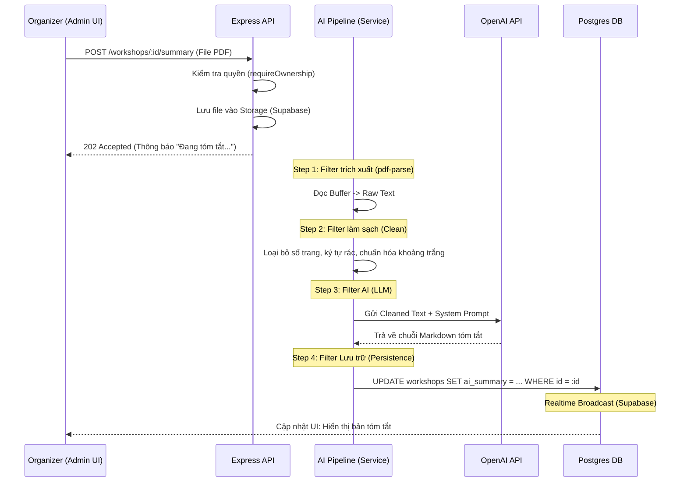
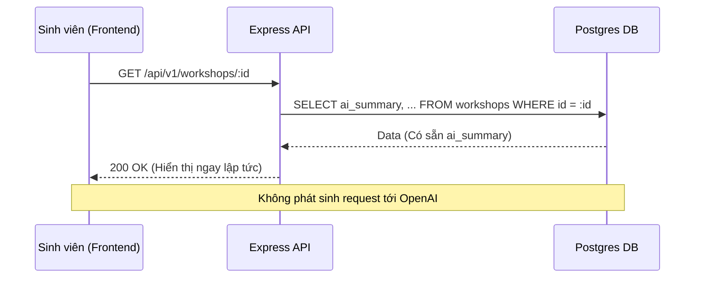

# Đặc tả: Tóm tắt nội dung Workshop bằng AI

> Trace về `requirement.md` mục "AI Summary" và quyết định kỹ thuật ADR-001 (Pipe-and-Filter).
>
> **Nhóm 16** — Đào Hoàng Đức Mạnh, Nguyễn Trần Minh Thư, Phạm Anh Hào

---

## 1. Mô tả và Yêu cầu bài toán

Ban tổ chức thường cung cấp các tài liệu giới thiệu chi tiết về workshop dưới dạng file PDF (đề cương, slide hoặc profile diễn giả). Để giúp sinh viên nhanh chóng nắm bắt giá trị cốt lõi của buổi workshop mà không cần đọc hết các tài liệu dài, hệ thống cung cấp tính năng tóm tắt tự động.

Dựa trên yêu cầu:
- **Tự động hóa:** Hệ thống tự trích xuất văn bản từ file PDF do Organizer tải lên.
- **AI Summary:** Sử dụng mô hình ngôn ngữ lớn (LLM) để tổng hợp thông tin thành các ý chính ngắn gọn.
- **Trải nghiệm:** Bản tóm tắt hiển thị trực tiếp tại trang chi tiết workshop cho sinh viên tham khảo.

---

## 2. Quyết định kiến trúc và Phân tích kỹ thuật

### 2.1 Phong cách kiến trúc: Pipe-and-Filter

Xử lý từ PDF sang văn bản tóm tắt là một chuỗi các bước biến đổi dữ liệu. Nhóm chọn kiến trúc **Pipe-and-Filter** để module hóa từng công đoạn xử lý:
1. **PDF Filter:** Dùng `pdf-parse` để đọc file nhị phân và trích xuất text thô.
2. **Cleaning Filter:** Sử dụng Regex/String xử lý để loại bỏ các ký tự lạ, số trang, đầu trang/chân trang nhằm giảm nhiễu cho AI và tiết kiệm token.
3. **AI Filter:** Gửi văn bản đã làm sạch qua OpenAI API với một System Prompt định hướng tóm tắt chuyên biệt.
4. **Persistence Filter:** Lưu kết quả vào DB để phục vụ việc hiển thị mà không cần gọi lại AI (Caching).

### 2.2 Xử lý văn bản dài (Chunking Strategy)

Vì các mô hình AI có giới hạn về ngữ cảnh (Context Window), nếu file PDF quá dài (ví dụ > 10 trang), hệ thống sẽ áp dụng kỹ thuật **Chunking**:
- Chia nhỏ văn bản thành các đoạn 2000 chữ.
- Tóm tắt từng đoạn rồi gộp các bản tóm tắt con lại để tạo bản tóm tắt cuối cùng (Map-Reduce pattern).

### 2.3 Quản lý chi phí và Tải trọng

Việc gọi API AI tốn kém và có độ trễ cao (5-10 giây). 
- **Quyết định:** Chỉ thực hiện tóm tắt **một lần duy nhất** khi Organizer upload tài liệu. Kết quả được lưu vĩnh viễn vào cột `ai_summary` của bảng `workshops`. 
- Khi sinh viên xem, hệ thống chỉ việc lấy dữ liệu từ DB, đảm bảo tốc độ phản hồi < 100ms và chi phí API OpenAI xấp xỉ bằng 0 đối với người dùng cuối.

---

## 3. Các luồng nghiệp vụ chính

### 3.1. Luồng xử lý tóm tắt bất đồng bộ (Pipeline Flow)

Vì việc gọi AI có độ trễ lớn, hệ thống không bắt người dùng đợi phản hồi đồng bộ mà xử lý thông qua một Pipeline chạy ngầm.

### 3.2. Luồng xem tóm tắt của Sinh viên (Cached View)

Sinh viên là đối tượng tiêu thụ nội dung, luồng này tối ưu tốc độ bằng cách truy cập trực tiếp dữ liệu đã xử lý.

---

## 4. Kịch bản lỗi và Cách xử lý

| Tình huống (Kịch bản) | Hệ quả | Cách xử lý của hệ thống |
|---|---|---|
| File PDF bị hỏng hoặc có mật khẩu | Filter 1 không thể đọc được nội dung. | Dừng Pipeline, bắn thông báo lỗi: `PDF_READ_FAILED`. Xóa file rác trong Storage. |
| PDF dạng ảnh quét (No OCR) | Text trích xuất rỗng hoặc quá ngắn. | Filter 2 kiểm tra độ dài text. Nếu < 50 từ -> Dừng và báo: "File PDF không chứa văn bản khả dụng". |
| OpenAI API bị quá tải (Rate Limit) | Request gửi sang AI bị lỗi 429 hoặc 503. | Sử dụng **Retry logic** (tối đa 3 lần với khoảng cách tăng dần). Nếu vẫn fail -> Ghi log lỗi và báo Organizer thử lại sau. |
| Nội dung tóm tắt chứa thông tin sai lệch | Hallucination (Ảo tưởng AI). | Sử dụng **Strict System Prompt** (yêu cầu AI chỉ tóm tắt dựa trên text cung cấp, không tự suy diễn). Organizer có quyền "Tóm tắt lại" để sinh bản mới. |
| File vượt quá Context Window | Văn bản quá dài khiến AI không nhận hết. | Tự động kích hoạt luồng **Map-Reduce**: Tóm tắt từng phần rồi tổng hợp lại bản cuối. |

---

## 5. Ràng buộc (Constraints)

1. **Giới hạn đầu vào:** Chỉ chấp nhận định dạng `.pdf`. Dung lượng tối đa **5MB** để tránh làm nghẽn băng thông và RAM của server khi parse text.
2. **Bảo mật API:** `OPENAI_API_KEY` chỉ được truy cập ở server-side. Tuyệt đối không expose thông tin model AI ra client để tránh bị dùng chùa (Prompt Injection/API abuse).
3. **Chi phí (Token limit):** Hệ thống giới hạn mỗi workshop chỉ được tóm tắt tối đa 3 lần (để tránh Organizer bấm liên tục gây lãng phí chi phí API).
4. **Quyền hạn:** Việc tạo bản tóm tắt là quyền đặc hữu của Organizer chủ quản workshop đó. Các Organizer khác và Sinh viên chỉ có quyền xem bản tóm tắt có sẵn.

---

## 6. Tiêu chí nghiệm thu (Acceptance Criteria)

1. **Pipeline hoạt động đúng:** Upload file PDF giới thiệu workshop -> Sau vài giây, bản tóm tắt hiện ra với định dạng Markdown (gạch đầu dòng, tiêu đề).
2. **Độ chính xác:** Nội dung tóm tắt phải chứa ít nhất 3 thông tin quan trọng: Mục tiêu workshop, Diễn giả, và Nội dung chính.
3. **Tính nhất quán:** F5 trang chi tiết workshop, bản tóm tắt phải hiển thị ngay lập tức (đã cache trong DB), không thấy hiện tượng "đang tải" từ AI nữa.
4. **Xử lý file lỗi:** Upload 1 file ảnh đổi đuôi thành `.pdf` -> Hệ thống phải báo lỗi hợp lệ, không được treo server (crash process).
5. **Phân quyền:** Dùng tài khoản của Organizer B để upload summary cho workshop của Organizer A -> Hệ thống trả về `403 Forbidden`.