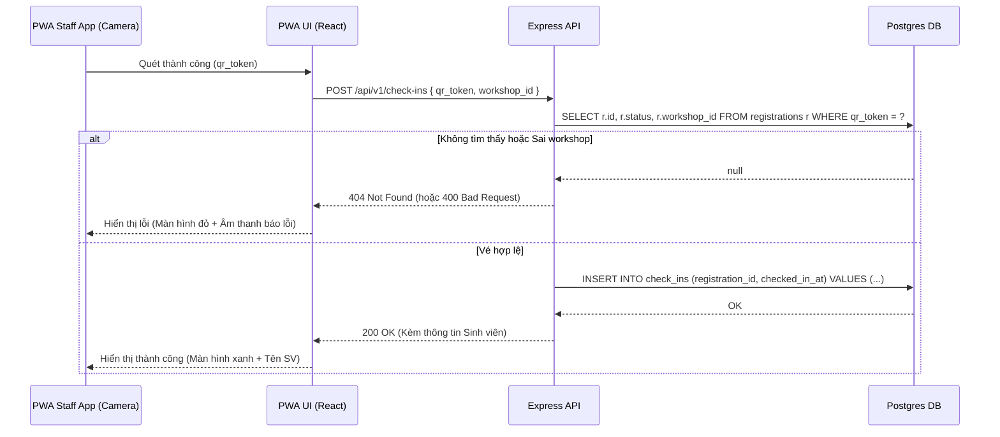
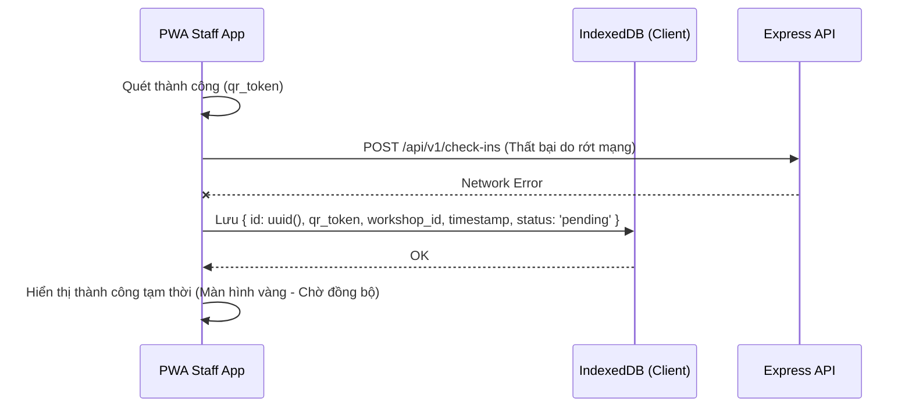
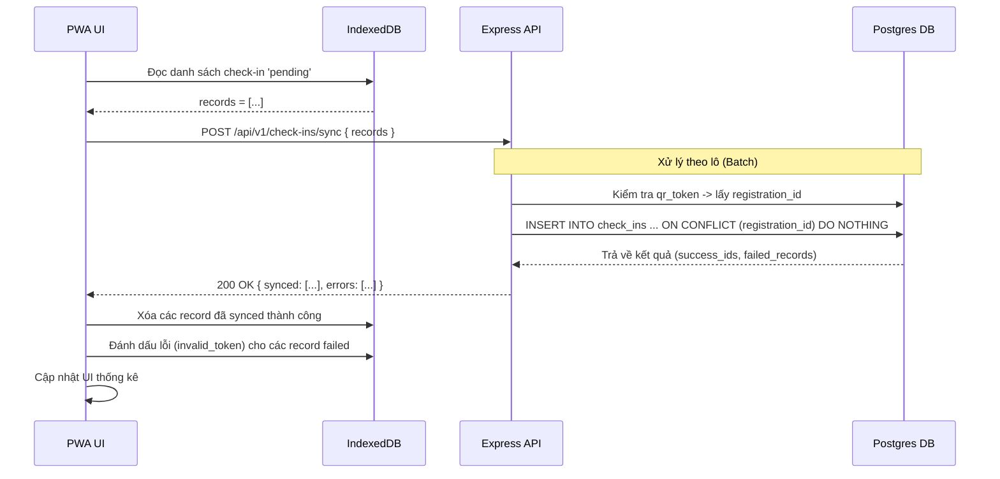

# Đặc tả: Quy trình Check-in và Đồng bộ Offline

> Trace về `requirement.md` mục "Check-in tại sự kiện" và `docs/architecture-decisions.md` mục ADR-009.
>
> **Nhóm 16** — Đào Hoàng Đức Mạnh, Nguyễn Trần Minh Thư, Phạm Anh Hào

---

## 1. Mô tả và Yêu cầu bài toán

Tính năng Check-in phục vụ việc điểm danh sinh viên tại cửa phòng hội trường thông qua việc quét mã QR. 

Đề bài đặt ra một ràng buộc thực tế rất cụ thể:
> *"Nhân sự tại cửa phòng dùng mobile app để quét mã QR của sinh viên. Một số khu vực trong trường có kết nối mạng không ổn định — app phải cho phép ghi nhận check-in tạm thời khi không có mạng và tự đồng bộ lại khi kết nối được phục hồi."*

Từ yêu cầu trên, tính năng Check-in không chỉ đơn thuần là một thao tác gọi API `POST /check-ins`, mà phải được thiết kế theo kiến trúc **Offline-first**. Cụ thể:
1. **Trạng thái Online:** Quét QR, gọi API, trả kết quả hợp lệ/không hợp lệ ngay lập tức, cập nhật realtime.
2. **Trạng thái Offline:** Quét QR, giải mã payload trực tiếp trên client để lấy thông tin, lưu tạm vào bộ nhớ thiết bị, cho sinh viên vào phòng để không gây ách tắc.
3. **Trạng thái Khôi phục mạng (Sync):** Tự động hoặc thủ công đẩy toàn bộ dữ liệu check-in tạm lên máy chủ, đảm bảo không mất dữ liệu (0% data loss) và xử lý triệt để các ca trùng lặp (ví dụ: quét 2 lần offline).

---

## 2. Quyết định kiến trúc và Phân tích kỹ thuật

### 2.1 PWA (Progressive Web App) vs Native App

Đề bài ghi *"dùng mobile app"*. Tuy nhiên, nhóm quyết định **không xây dựng ứng dụng Native (iOS/Android) mà sử dụng PWA**.

| Tiêu chí | PWA (vite-plugin-pwa) | Native App (React Native/Flutter) |
|---|---|---|
| Môi trường chạy | Trình duyệt mobile (thêm vào màn hình chính) | App Store / Google Play |
| Camera API | Hỗ trợ tốt qua WebRTC (`html5-qrcode`) | Cần config native permissions phức tạp |
| Lưu trữ offline | IndexedDB (lên tới hàng trăm MB, quá đủ lưu text) | SQLite / Async Storage |
| Chi phí phát triển | Tận dụng codebase React hiện có, 0.5 ngày setup | 2-3 ngày setup riêng 1 repo mới |
| Thỏa mãn đề bài? | **Có** (PWA cài ra màn hình chính có UX như một app) | Có |

→ **Quyết định:** Chọn PWA (ADR-009). Phù hợp với nhân sự của nhóm (3 người, thời gian ngắn), vẫn đáp ứng đúng trải nghiệm quét mã trên điện thoại và khả năng lưu trữ offline.

### 2.2 Cơ chế đồng bộ: Foreground Sync vs Background Sync API

Khi thiết bị offline lưu dữ liệu vào IndexedDB, lúc có mạng trở lại ta cần đồng bộ lên server.

- **Background Sync API (Service Worker):** Tự động đồng bộ ngầm ngay cả khi user đã đóng trình duyệt. Tuy nhiên, **iOS Safari không hỗ trợ API này**. Nếu dùng, toàn bộ thiết bị iPhone của nhân sự sẽ bị lỗi không đồng bộ được.
- **Foreground Sync (Thủ công + Event listener):** Dữ liệu chỉ được đồng bộ khi app đang mở ở màn hình. Bắt sự kiện `window.addEventListener('online')` để tự động flush dữ liệu, kết hợp một nút "Đồng bộ ngay" trên UI để nhân sự chủ động bấm.

→ **Quyết định:** Sử dụng **Foreground Sync**. Chấp nhận việc nhân sự phải mở app khi có mạng để đẩy dữ liệu, đổi lại độ tương thích 100% trên cả Android và iOS.

### 2.3 Cơ chế chống trùng lặp dữ liệu (Idempotency trong Check-in)

Một ngoại lệ nghiêm trọng: Sinh viên X quét mã khi máy nhân sự đang offline. Thiết bị ghi nhận tạm. Vài phút sau, máy nhân sự có mạng, đồng bộ bản ghi này lên server. Trong lúc đó, nếu không có cơ chế chặn trùng lặp, lỡ nhân sự bấm "Đồng bộ" 2 lần do mạng chập chờn thì sao?

→ **Quyết định xử lý:**
1. Mỗi bản ghi check-in offline sinh ra một `client_id` (UUID) duy nhất trên máy.
2. Endpoint `POST /api/v1/check-ins/sync` nhận vào một mảng các bản check-in.
3. Ở database, tạo ràng buộc `UNIQUE(registration_id)` ở bảng `check_ins` (một vé chỉ được check-in 1 lần). Nếu có conflict do client đẩy lên nhiều lần, database sẽ `ON CONFLICT DO NOTHING`. Server vẫn trả về mã 200 cho client để client xóa bản ghi tạm trong IndexedDB (chống kẹt dữ liệu).

---

## 3. Các luồng nghiệp vụ chính

### 3.1. Luồng Check-in khi có mạng (Online Flow)

Trong điều kiện lý tưởng, quy trình diễn ra theo thời gian thực. API đóng vai trò Source of Truth kiểm tra tính hợp lệ của vé.

### 3.2. Luồng Check-in khi mất mạng (Offline Flow)

Khi PWA phát hiện mất kết nối (`navigator.onLine === false` hoặc API gọi bị timeout/fetch failed), hệ thống tự động chuyển sang chế độ Offline.

**Trade-off (Sự đánh đổi về mặt nghiệp vụ):**
Mã QR chỉ chứa một chuỗi `qr_token` ngẫu nhiên. Khi offline, PWA không thể truy cập Database để biết vé này có hợp lệ hay không (hoặc có đúng workshop không). Nhóm quyết định: **Chấp nhận rủi ro quét nhầm vé lỗi để ưu tiên giải phóng đám đông**. Máy quét sẽ lưu tạm mọi token quét được, các vé lỗi sẽ bị server từ chối ở bước Sync sau đó.

### 3.3. Luồng Đồng bộ dữ liệu (Sync Flow)

Kích hoạt khi nhân sự bấm nút "Đồng bộ ngay" hoặc PWA bắt được event `window.addEventListener('online')`.

---

## 4. Kịch bản lỗi và Cách xử lý

| Tình huống (Kịch bản) | HTTP Status | Xử lý tại Backend (API) | Xử lý tại Frontend (PWA) |
|---|---|---|---|
| Mã QR không tồn tại trong hệ thống (Vé giả) | 404 | Trả lỗi `TICKET_NOT_FOUND`. | Hiển thị màn hình báo lỗi, yêu cầu SV kiểm tra lại vé. |
| Mã QR hợp lệ nhưng khác workshop | 400 | Trả lỗi `WRONG_WORKSHOP` (Vé này dành cho phòng khác). | Hiển thị lỗi "Sai phòng" kèm tên phòng đúng của sinh viên. |
| Sinh viên quét mã 2 lần (Double check-in online) | 409 | `UNIQUE` constraint trên DB ngăn chặn. Trả lỗi `ALREADY_CHECKED_IN`. | Báo "Vé đã được sử dụng" kèm thời gian check-in lần đầu. |
| Mạng chập chờn, PWA gửi trùng 1 gói Sync 2 lần | 200 | `INSERT ON CONFLICT DO NOTHING`. Server vẫn trả success cho các ID này. | PWA nhận success, yên tâm xóa dữ liệu tạm trong IndexedDB. |
| Trong gói Sync có vé giả (do Offline quét nhầm) | 200 | Vẫn process thành công các vé đúng. Trả về mảng `errors` chứa thông tin vé giả. | Báo cáo trên UI: "Đồng bộ hoàn tất. Có N vé không hợp lệ". |

> **Lưu ý thiết kế API Sync:** Endpoint `/sync` không trả `4xx` hay `5xx` nếu có 1 vé lỗi trong lô 100 vé. Nó trả `200 OK` kèm payload chi tiết phân loại thành công/thất bại (Partial Success Pattern). Điều này tránh việc toàn bộ lô dữ liệu bị kẹt ở Client chỉ vì 1 dòng dữ liệu rác.

---

## 5. Ràng buộc (Constraints)

1. **Bảo mật mã QR:** `qr_token` phải là UUIDv4 hoặc chuỗi cryptographically secure sinh ra tại backend lúc đăng ký. Không được dùng thông tin dễ đoán (như ghép MSSV + ID Workshop) để chống việc sinh viên tự tạo QR giả.
2. **Quyền truy cập (RBAC):** Chỉ user có role `staff` hoặc `organizer` mới được gọi các API `POST /api/v1/check-ins` và `/sync`. Sinh viên không tự check-in được (tham chiếu spec `access-control.md`).
3. **Data Retention Client:** Dữ liệu trong IndexedDB không tự động xóa nếu chưa Sync thành công (chống mất data). Nếu nhân sự lỡ F5 trang, dữ liệu vẫn còn.

---

## 6. Tiêu chí nghiệm thu (Acceptance Criteria)

Các test case bắt buộc phải qua (có thể test thủ công hoặc E2E):

1. **Check-in thành công (Online):** Quét mã hợp lệ -> màn hình báo xanh -> DB có thêm 1 dòng trong bảng `check_ins`.
2. **Double check-in chặn đúng (Online):** Dùng lại mã vừa quét -> màn hình báo đỏ (Đã check-in).
3. **Chế độ Offline kích hoạt:** Tắt WiFi/4G trên điện thoại -> Quét mã -> màn hình báo vàng (Lưu tạm) -> DB chưa có dữ liệu. IndexedDB có 1 record.
4. **Đồng bộ thành công (Sync):** Bật lại WiFi -> bấm "Đồng bộ" -> Dữ liệu từ IndexedDB bị xóa -> DB nhận được dòng dữ liệu với `checked_in_at` lùi về đúng thời điểm quét offline.
5. **Chống lỗi trùng lặp khi Sync:** Lấy 1 vé đã check-in thành công trước đó, ép lưu vào IndexedDB và bấm Sync -> Hệ thống báo Sync thành công, nhưng trong DB vẫn chỉ có 1 dòng duy nhất cho vé đó (không bị crash server do trùng PK).
6. **Xác thực quyền:** Lấy token JWT của tài khoản sinh viên gọi API `/check-ins` -> Trả về 403 Forbidden.
