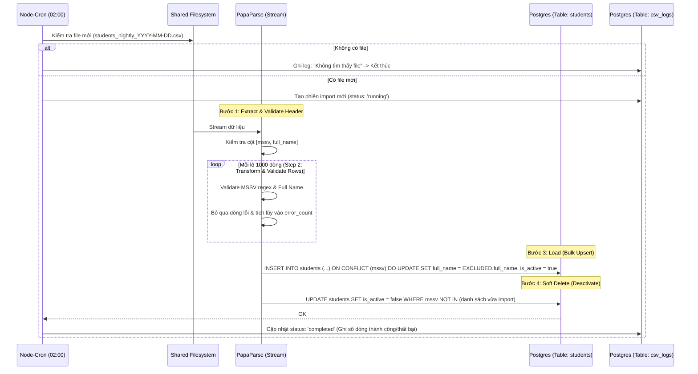
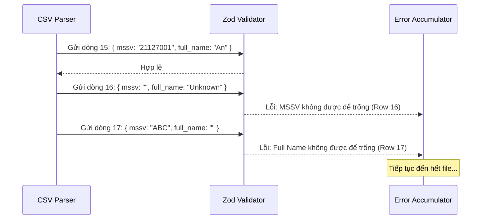

# Đặc tả: Đồng bộ dữ liệu Sinh viên từ CSV (Batch Processing)

> Trace về `requirement.md` mục "Đồng bộ dữ liệu sinh viên", "Tích hợp một chiều" và quyết định kỹ thuật ADR-013.
>
> **Nhóm 16** — Đào Hoàng Đức Mạnh, Nguyễn Trần Minh Thư, Phạm Anh Hào

---

## 1. Mô tả và Yêu cầu bài toán

Hệ thống quản lý sinh viên hiện tại của trường (Legacy System) là một hệ thống đóng, không có API để truy xuất trực tiếp. Cách duy nhất để UniHub Workshop có dữ liệu định danh sinh viên (nhằm cho phép đăng ký workshop) là thông qua các file CSV được hệ thống cũ export định kỳ vào ban đêm.

Yêu cầu bài toán đặt ra các thách thức:
- **Độ tin cậy:** File CSV có thể bị sai định dạng, thiếu cột hoặc chứa dữ liệu rác. Tiến trình import không được phép "chết" (crash) giữa chừng và phải báo cáo rõ ràng các dòng bị lỗi.
- **Tính nhất quán:** Dữ liệu sinh viên (MSSV) là khóa chính để xác thực đăng ký. Việc import phải xử lý được các trường hợp sinh viên mới nhập học, sinh viên đổi tên, hoặc sinh viên đã nghỉ học (không còn trong danh sách CSV).
- **Hiệu năng:** File CSV có thể chứa hàng chục nghìn dòng. Việc thực hiện hàng chục nghìn câu lệnh `INSERT` đơn lẻ sẽ làm treo Database. Cần cơ chế xử lý theo lô (Bulk Upsert).

---

## 2. Quyết định kiến trúc và Phân tích kỹ thuật

### 2.1 Phong cách kiến trúc: Batch Sequential (ETL Pipeline)

Nhóm áp dụng mô hình **ETL (Extract - Transform - Load)** chia làm 4 giai đoạn nối tiếp nhau để xử lý file CSV:

1. **Extract (Trích xuất):** Đọc file từ shared filesystem (hoặc upload qua admin) bằng thư viện `PapaParse`. Thư viện này hỗ trợ đọc theo luồng (stream), không nạp toàn bộ file vào RAM, giúp hệ thống chịu được file dung lượng lớn.
2. **Validate (Kiểm tra):** Kiểm tra cấu trúc Header (phải có `mssv`, `full_name`) và kiểm tra kiểu dữ liệu từng dòng bằng `Zod`.
3. **Transform (Chuyển đổi):** Chuẩn hóa văn bản (trim khoảng trắng, viết hoa đúng chuẩn), lọc bỏ các dòng trùng lặp trong chính file CSV.
4. **Load (Nạp):** Thực hiện Bulk Upsert vào PostgreSQL.

### 2.2 Chiến lược cập nhật dữ liệu: Upsert & Soft Delete

Để xử lý sự biến động của danh sách sinh viên giữa hệ thống cũ và UniHub, nhóm áp dụng logic sau:

- **Có trong CSV, không có trong DB:** Thêm mới (INSERT) sinh viên, mặc định `is_active = true`.
- **Có trong CSV và có trong DB:** Cập nhật (UPDATE) thông tin `full_name` nếu có thay đổi để đồng bộ với danh sách mới nhất.
- **Có trong DB nhưng biến mất trong CSV:** Đánh dấu `is_active = false` (Soft Delete). Nhóm quyết định **không xóa cứng** (Hard Delete) bản ghi này để giữ toàn vẹn dữ liệu (Referential Integrity) cho các bản đăng ký workshop trong quá khứ của sinh viên đó.

### 2.3 Quản lý lỗi và Audit Log

Thay vì dừng tiến trình khi gặp lỗi (Fail-fast), hệ thống áp dụng chiến lược **Partial Success**:
- Dòng nào sai định dạng -> Bỏ qua dòng đó, ghi lại lỗi vào bảng `csv_import_logs`.
- Dòng nào đúng -> Tiếp tục xử lý.
Sau khi kết thúc, Ban tổ chức có thể xem báo cáo: "Thành công 998 dòng, Thất bại 2 dòng (Dòng 15, 102)".

### 2.4 Cơ chế kích hoạt: Cron Job in-process

Theo yêu cầu hệ thống cũ export vào ban đêm, nhóm sử dụng `node-cron` chạy trực tiếp bên trong Express API (Single Instance).
- **Thời điểm chạy:** 02:00 sáng hàng ngày.
- **Lý do:** Đây là thời điểm lượng truy cập thấp nhất, tránh tranh chấp tài nguyên với luồng đăng ký của sinh viên.

---

## 3. Các luồng nghiệp vụ chính

### 3.1. Luồng ETL Nightly Job (02:00 AM)

Tiến trình chạy ngầm để đồng bộ dữ liệu mà không cần sự can thiệp của con người.

### 3.2. Luồng xử lý lỗi tại dòng (Row-level Error Handling)

Hệ thống đảm bảo một vài dòng dữ liệu rác không làm hỏng toàn bộ tiến trình.

---

## 4. Kịch bản lỗi và Cách xử lý

| Tình huống (Kịch bản) | Hệ quả | Cách xử lý của hệ thống |
|---|---|---|
| File CSV sai Header (ví dụ: `id, name` thay vì `mssv, full_name`) | Không thể ánh xạ dữ liệu. | Dừng ngay lập tức (Fail-fast at file level). Ghi log lỗi "Header mismatch" và bắn thông báo tới Organizer qua dashboard admin. |
| File CSV trống (0 dòng dữ liệu) | Không có dữ liệu để import. | Ghi log cảnh báo nhưng không báo lỗi. Không thực hiện Soft Delete (để tránh vô tình deactivate toàn bộ sinh viên trong DB). |
| Dòng dữ liệu thiếu cột MSSV hoặc tên quá dài | Dòng đó không hợp lệ. | Bỏ qua dòng đó, tăng biến `failed_rows_count`. Ghi chi tiết số dòng và nội dung lỗi vào bảng `csv_import_logs`. |
| Import file cũ (ngày hôm trước) | Dữ liệu bị stale (cũ). | Kiểm tra `source_date` trong tên file. Nếu ngày của file < hoặc = ngày import gần nhất -> Bỏ qua để tránh ghi đè dữ liệu mới bằng dữ liệu cũ. |
| Server crash/restart khi đang import giữa chừng | Dữ liệu có thể bị nạp một nửa. | Nhờ tính chất **Idempotent** của Bulk Upsert (`ON CONFLICT DO UPDATE`), khi server khởi động lại và chạy lại job, dữ liệu sẽ được ghi đè chính xác mà không gây trùng lặp hay lỗi PK. |

---

## 5. Ràng buộc (Constraints)

1. **Định dạng file:** Tên file phải tuân thủ format `students_nightly_YYYY-MM-DD.csv`. Encoding bắt buộc là **UTF-8** (để giữ dấu tiếng Việt).
2. **Bộ nhớ (Memory):** Không được dùng `fs.readFileSync()` (đọc toàn bộ file vào RAM). Phải dùng `fs.createReadStream()` kết hợp với chế độ `step` (streaming) của PapaParse để xử lý được file > 100MB trên môi trường RAM hạn chế.
3. **Giới hạn Bulk Insert:** Để tránh làm nghẽn transaction log của Postgres, mỗi lệnh SQL Upsert chỉ nên xử lý tối đa **1.000 - 2.000 dòng** một lúc (Batching).
4. **Toàn vẹn dữ liệu (Referential Integrity):** Tuyệt đối không xóa dòng trong bảng `students` (No Hard Delete). Mọi hành động xóa đều là cập nhật flag `is_active = false`.

---

## 6. Tiêu chí nghiệm thu (Acceptance Criteria)

Các tiêu chí để đánh giá tính năng hoạt động đúng:

1. **Import thành công:** File CSV 10 dòng đúng -> DB bảng `students` có 10 bản ghi, `is_active = true`.
2. **Upsert hoạt động:** File ngày 2 có 1 sinh viên đổi tên (cùng MSSV) -> DB cập nhật `full_name` mới, không tạo thêm bản ghi mới.
3. **Soft Delete hoạt động:** Sinh viên A có trong DB nhưng không còn tên trong file CSV mới -> Trạng thái sinh viên A trong DB chuyển thành `is_active = false`.
4. **Xử lý lỗi ổn định:** File CSV có 8 dòng đúng, 2 dòng sai format -> Import thành công 8 dòng, 2 dòng lỗi được liệt kê chi tiết trong log (số dòng, lý do lỗi). Hệ thống không được crash.
5. **Chống trùng file:** Chạy import 1 file 2 lần -> Lần thứ 2 hệ thống báo "File đã được xử lý" và không thực hiện lại logic DB.
6. **Bảo mật:** Endpoint kích hoạt import thủ công (`POST /api/v1/admin/csv-import`) phải được bảo vệ bởi middleware `requireRole(['organizer'])`.