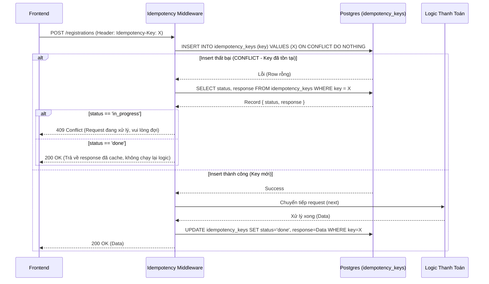
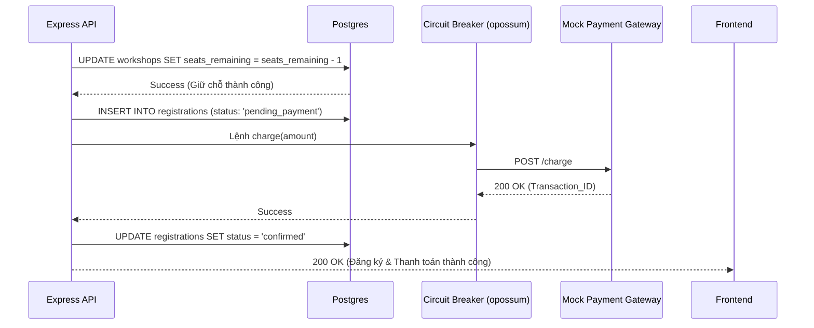
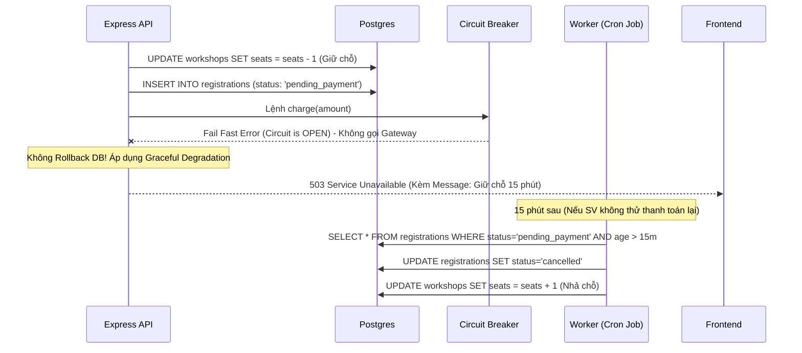

# Đặc tả: Luồng thanh toán an toàn (Circuit Breaker & Idempotency)

> Trace về `requirement.md` mục "Thanh toán không ổn định", "Chống trừ tiền hai lần" và các quyết định kỹ thuật ADR-007, ADR-008.
>
> **Nhóm 16** — Đào Hoàng Đức Mạnh, Nguyễn Trần Minh Thư, Phạm Anh Hào

---

## 1. Mô tả và Yêu cầu bài toán

Trong hệ thống UniHub Workshop, quy trình đăng ký cho các workshop có phí đòi hỏi sự tương tác với một Cổng thanh toán (Payment Gateway). Quá trình này phải đối mặt với hai vấn đề kỹ thuật kinh điển của hệ thống phân tán:

1. **Vấn đề phía Client (Trừ tiền hai lần):** Do mạng lag hoặc do mất kiên nhẫn, sinh viên có thể bấm nút "Thanh toán" nhiều lần liên tiếp. Hệ thống phải đảm bảo dù nhận được 3 request gửi đến cùng lúc, tiền (và số chỗ) chỉ được xử lý đúng 1 lần.
2. **Vấn đề phía Server (Gateway sập):** Cổng thanh toán có thể bị quá tải, phản hồi chậm (timeout) hoặc sập hoàn toàn. Nếu Express API cứ cố gọi một dịch vụ đang chết, các request sẽ bị treo, dẫn đến sập luôn cả Backend (Cascading Failure). Đồng thời, khi thanh toán lỗi, hệ thống phải có cơ chế nhả chỗ hoặc giữ chỗ một cách hợp lý để không ảnh hưởng đến người dùng khác.

Nhiệm vụ của spec này là định nghĩa cách hệ thống giải quyết triệt để hai bài toán trên.

---

## 2. Quyết định kiến trúc và Phân tích kỹ thuật

### 2.1 Cơ chế chống trừ tiền hai lần: Idempotency Key với PostgreSQL

Để phân biệt giữa "2 sinh viên cùng đăng ký 1 workshop" và "1 sinh viên gửi trùng 1 request 2 lần do mạng lag", frontend sẽ sinh ra một mã `Idempotency-Key` (UUIDv4) duy nhất cho mỗi *ý định* thanh toán và đính kèm vào HTTP Header.

**Vì sao chọn Postgres `INSERT ON CONFLICT` thay vì Redis? (Tham chiếu ADR-008, ADR-011)**
Thông thường, Idempotency được lưu ở Redis để truy xuất nhanh. Tuy nhiên, nhóm quyết định tận dụng PostgreSQL để giữ cho hệ thống MVP đơn giản (không cõng thêm Redis). 
- Pattern `INSERT INTO idempotency_keys (key) VALUES (...) ON CONFLICT DO NOTHING RETURNING key` là một phép toán **atomic**. 
- Dù 2 request đến cùng một micro-second, row-level lock của Postgres đảm bảo chỉ đúng 1 request insert thành công và đi tiếp. Request thứ 2 sẽ bị chặn lại ngay lập tức và nhận về kết quả (response) đã được lưu từ request thứ nhất.

### 2.2 Xử lý Gateway sập: Circuit Breaker với thư viện `opossum`

Thay vì gọi trực tiếp `MockPaymentGateway.charge()`, hệ thống bọc lệnh gọi này trong một **Circuit Breaker** (Cầu dao điện).

- **Trạng thái CLOSED (Đóng mạch - Hoạt động bình thường):** Lệnh thanh toán được pass qua.
- **Trạng thái OPEN (Ngắt mạch - Có sự cố):** Kích hoạt khi tỷ lệ lỗi (Error Rate) vượt ngưỡng **50%** hoặc timeout quá 3000ms. Lúc này, mọi request thanh toán mới sẽ **BỊ CHẶN NGAY LẬP TỨC** (Fail Fast) mà không cần gọi sang Gateway.
- **Trạng thái HALF-OPEN (Thử nghiệm lại):** Sau 30 giây (resetTimeout), cầu dao hé mở cho phép 1 request đi qua để test. Nếu thành công -> chuyển về CLOSED. Nếu lại fail -> quay về OPEN.

### 2.3 Graceful Degradation (Giảm cấp duyên dáng) khi Circuit Breaker OPEN

Đề bài yêu cầu: *"tính năng không liên quan thanh toán vẫn phải hoạt động bình thường khi cổng thanh toán gặp sự cố"*.

**Quyết định thiết kế (Graceful Degradation):**
Khi phát hiện Circuit Breaker đang OPEN (hoặc thanh toán thất bại), hệ thống **không** trả lỗi và xóa lượt đăng ký ngay. Thay vào đó:
1. Ghi nhận lượt đăng ký (Registration) với trạng thái `pending_payment`.
2. Vẫn trừ đi 1 chỗ ngồi (`seats_remaining = seats_remaining - 1`) để giữ chỗ.
3. Trả về Frontend thông báo: *"Thanh toán tạm thời không khả dụng. Hệ thống giữ chỗ của bạn trong 15 phút, vui lòng thử lại sau."*
4. Một **Cron Job** (chạy mỗi phút) sẽ quét các bản ghi `pending_payment` quá 15 phút. Nếu hết hạn, nó sẽ đổi trạng thái thành `cancelled` và hoàn lại chỗ (`seats_remaining + 1`).

---

## 3. Các luồng nghiệp vụ chính

### 3.1. Luồng bảo vệ Idempotency (Chặn request trùng lặp)

Luồng này được thực thi bởi một Middleware ở đầu API `POST /api/v1/registrations` trước khi chạm vào logic nghiệp vụ và thanh toán.

### 3.2. Luồng Thanh toán bình thường (Circuit Breaker: CLOSED)

Giả định request đã lọt qua được chốt chặn Idempotency.

### 3.3. Luồng Gateway sự cố (Circuit Breaker: OPEN) và Graceful Degradation

Khi Gateway liên tục trả lỗi (vượt ngưỡng 50%) hoặc Timeout, Circuit Breaker ngắt mạch (OPEN).

---

## 4. Kịch bản lỗi và Cách xử lý

| Tình huống (Kịch bản) | Xử lý tại Backend (Circuit Breaker & Logic) | Trải nghiệm phía người dùng (Frontend) |
|---|---|---|
| Người dùng double click nút "Thanh toán" | Idempotency Middleware bắt request thứ 2, trả 409 `REQUEST_IN_PROGRESS` nếu req 1 chưa xong, hoặc trả data cache nếu req 1 đã xong. | UI chặn click tiếp (disable button). Nếu bypass được UI, hệ thống vẫn không trừ tiền 2 lần. |
| Gateway xử lý quá lâu (Timeout > 3s) | Circuit Breaker bắt lỗi Timeout, tính là 1 failed request. Registration chuyển sang `pending_payment`. | Báo lỗi: "Cổng thanh toán phản hồi chậm. Chỗ của bạn đã được giữ trong 15 phút, vui lòng thử lại sau." |
| Gateway lỗi 500 liên tục (> 50% request lỗi) | CB ngắt mạch (OPEN). Các request tiếp theo bị từ chối ngay lập tức (Fail fast) để bảo vệ thread pool của Express. | Báo lỗi: "Thanh toán tạm thời không khả dụng. Chỗ được giữ 15 phút..." |
| Thẻ hết tiền, sai CVV (Lỗi nghiệp vụ từ Gateway) | Đây là lỗi nghiệp vụ (4xx từ Gateway), **không** được làm tăng Error Rate của CB. Cập nhật registration thành `cancelled` và nhả chỗ. | Báo lỗi: "Thẻ không đủ số dư hoặc thông tin sai. Vui lòng kiểm tra lại." Chỗ bị hủy ngay lập tức. |

---

## 5. Ràng buộc (Constraints)

1. **Vòng đời Idempotency Key:** Khóa được sinh bằng `crypto.randomUUID()` phía frontend. Lưu trong React State (reload trang sẽ mất). Khóa trên Database có TTL là **24 giờ** (sau đó tự động dọn dẹp để tiết kiệm dung lượng).
2. **Ngưỡng Circuit Breaker:**
   - `errorThresholdPercentage`: 50% (Mạch mở khi 50% request trong volume fail).
   - `timeout`: 3000ms (Quá 3s coi như fail).
   - `resetTimeout`: 30000ms (Sau 30s mở mạch bán phần - Half Open để thử nghiệm lại).
3. **Phân biệt Lỗi Hệ thống và Lỗi Nghiệp vụ:** CB chỉ được phép bắt các ngoại lệ hệ thống (Network error, 5xx, Timeout). Các lỗi thanh toán 4xx (Sai mã thẻ, hết tiền) phải được code bỏ qua (bypass), không làm trip Circuit Breaker.

---

## 6. Tiêu chí nghiệm thu (Acceptance Criteria)

Các kịch bản cần được Verify qua Unit Test (Vitest) hoặc test E2E:

1. **Idempotency hoạt động:** Gửi 2 request `POST /registrations` cùng chung Payload và cùng chung Header `Idempotency-Key`. Database chỉ chèn đúng 1 bản ghi `registrations`, bị trừ đúng 1 chỗ ngồi và chỉ 1 lần gọi Gateway mock.
2. **Circuit Breaker ngắt đúng lúc:** Ép mock gateway trả lỗi 500 liên tục 5 lần. Request thứ 6 gọi tới phải nhận ngay lỗi `Circuit is open` trong chưa tới 10ms (không bị delay 3s timeout).
3. **Graceful Degradation (Giữ chỗ 15 phút):** Khi CB Open, đăng ký thành công bị đẩy vào `pending_payment`. Gọi endpoint kiểm tra số chỗ trống -> Số chỗ phải giảm đi 1 so với ban đầu.
4. **Nhả chỗ thành công:** Chạy Worker (Cron) quét các bản ghi `pending_payment` ép thời gian về quá khứ 16 phút. Kiểm tra thấy `registrations` đổi trạng thái thành `cancelled` và bảng `workshops` được cộng lại 1 chỗ.